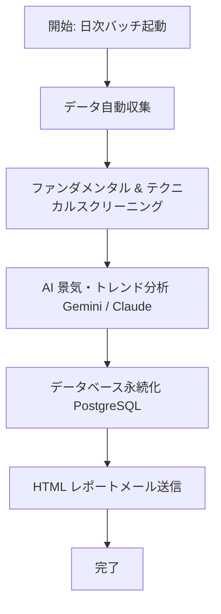

# 外部機能仕様書 (Functional Specification)

> **ドキュメントID**: SPEC-EXT-001
> **対象システム**: 個人投資家向け投資判断支援ツール (Investment Decision Support Tool)
> **最終更新日**: 2026-07-23

---

## 1. システム概要と目的

### 1.1 目的

本システムは、個人投資家が感情に左右されず、データとAIに基づいた客観的かつ体系的な投資判断を行えるよう支援するツールです。
市場データ・マクロ指標・ファンダメンタルズ・テクニカル指標の自動収集およびスクリーニングから、AIによる景気フェーズ判定・アセットアロケーション提案、リスク管理（トレーリングストップ・出口シグナル診断）、投資結果の振り返り（投資日記）までを一貫してサポートします。

### 1.2 主なターゲットユーザー

- 日本株・米国株を取引する個人投資家
- スイングトレードおよび中長期投資を行う投資家
- マクロ経済指標やAI分析に基づき、データドリブンなアセットアロケーションを行いたいユーザー

---

## 2. 機能一覧

| 機能グループ           | 機能名称                        | 概要                                                                              | 提供形式           |
| ---------------------- | ------------------------------- | --------------------------------------------------------------------------------- | ------------------ |
| **ユーザー認証**       | ログイン / ログアウト           | JWTトークンに基づく安全な認証管理とユーザーセッション制御                         | Web UI / API       |
| **Webダッシュボード**  | マクロ環境・トレンド可視化      | 最新のマクロ景気フェーズ、推奨アロケーション、ソーシャルトレンドの表示            | Web UI             |
|                        | 推奨銘柄リスト                  | AI/バッチにより厳選されたスクリーニング銘柄の比較・閲覧                           | Web UI             |
|                        | エントリー中銘柄（リスク管理）  | 保有ポジション一覧、損切ライン切り上げ、出口シグナル（危険/警告）表示             | Web UI             |
|                        | テクニカルチャート分析          | ローソク足、移動平均線、RSI、ボリンジャーバンドの表示と対話的分析                 | Web UI             |
|                        | 運用状況・投資日記              | 売買履歴の記録、投資判断メモの記述、パフォーマンス（損益）計算、CSV出力           | Web UI             |
|                        | 過去のAIレポート                | 配信された日次AI分析レポートのアーカイブ閲覧および検索                            | Web UI             |
| **ツール・計算機能**   | ポジションサイジング計算機      | 総資産・許容リスク率・損切幅に応じた最適購入株数・投入金額の算出                  | Web UI (モーダル)  |
| **ワークフローバッチ** | データ自動収集 & スクリーニング | Yahoo!ファイナンス・FRED・財務省等からのデータ取得と指標フィルタリング            | バックエンド / CLI |
|                        | AI 景気・トレンド分析           | Google Gemini / Claude を活用したマクロ分析およびX/Googleトレンド影響レポート生成 | バックエンド / CLI |
|                        | 結果保存 & メール通知           | 分析結果のデータベース保存と、フォーマット済みHTMLメール送信                      | バックエンド / CLI |
| **ユーザー管理**       | アカウント作成 CLI              | システム管理者がダッシュボード用ログインアカウントを追加・管理するユーティリティ  | CLI                |

---

## 3. 画面・機能詳細仕様

### 3.1 ユーザー認証機能

- **ログイン画面**:
  - ユーザー名およびパスワードを入力して認証を行います。
  - 認証成功時、サーバーより発行されたJWTトークンをローカルストレージ（`localStorage`）へ保存し、ダッシュボード画面へ遷移します。
- **セッション維持・ログアウト**:
  - API呼び出し時にはヘッダーに `Authorization: Bearer <token>` を自動付与します。
  - ログアウトボタン押下でトークンを削除し、未ログイン状態へ復帰します。

### 3.2 Webダッシュボード画面

#### 3.2.1 マクロ環境・ダッシュボード

- **マクロ経済環境表示**:
  - 現在の景気フェーズ（回復期、拡大期、成熟期、後退期など）、推奨アセットアロケーション比率（株式/現金/債券等）を表示。
- **主要市場指数サマリー**:
  - 日経平均、TOPIX、S&P500、ドル円為替レート等の最新値・前日比。
- **ソーシャルトレンド分析**:
  - X（旧Twitter）やGoogle検索トレンドにおける日本株関連ワードのセンチメント（強気/弱気）とAI解説。

#### 3.2.2 推奨銘柄画面

- **一覧表示項目**: 銘柄コード、銘柄名、株価、PER、PBR、ROE、配当利回り、スコア、AIコメント。
- **フィルター・ソート**: セクター別絞り込み、各種ファンダメンタルズ指標に基づく並び替え。
- **アクション**: 該当銘柄を「保有（エントリー中）銘柄へ追加」または「ポジションサイジング計算機を起動」。

#### 3.2.3 エントリー中銘柄画面

- **保有ポジション表示**:
  - 銘柄名、取得単価、現在値、株数、評価損益、目標株価、損切ラインを表示。
- **トレーリングストップ機能**:
  - 現在値の更新に応じて、過去最高値からの落とし幅（指定%）に基づく推奨損切ラインを自動計算・表示。
- **出口シグナル診断**:
  - 以下の条件に合致した場合、警告バッジ（赤：要売り / 黄：注意）を表示。
    - **目標株価到達**: 現在値 ≧ 目標株価
    - **損切り到達**: 現在値 ≤ 損切設定値
    - **RSI過熱**: 14日RSI ≧ 70 (買われすぎ) または ≦ 30 (売られすぎ)
    - **決算前警戒**: 決算発表予定日まで3日以内

#### 3.2.4 テクニカルチャート分析画面

- **表示機能**:
  - 対象銘柄のローソク足チャート（日足/週足）
  - 移動平均線（5日、25日、75日）
  - ボリンジャーバンド（±2σ）
  - サブチャート：RSI (14日)、出来高
- **対話操作**:
  - 期間切替（1ヶ月、3ヶ月、6ヶ月、1年）
  - 指標の表示/非表示トグル

#### 3.2.5 運用状況・投資日記画面

- **取引記録一覧**:
  - 約定日、銘柄コード、売買種別（買/売）、株数、単価、実現損益、投資理由メモ。
- **投資日記機能**:
  - 各取引に対する「エントリー理由」「エグジット理由」「反省点・振り返り」を自由テキストで記録。
- **CSVデータエクスポート**:
  - 登録された全取引履歴を標準CSV形式でダウンロード可能。

#### 3.2.6 過去のAIレポート画面

- **アーカイブ参照**:
  - 日次ワークフローで生成された過去のAIレポート一覧を日付順に表示。
- **詳細閲覧**:
  - レポートを選択して、生成されたHTML/Markdownテキスト（景気判断、注目セクター、スクリーニング結果詳細）を表示。

---

### 3.3 ポジションサイジング計算機能

投資家が1回の取引で取るリスク量を一定に保つための適切な購入株数計算ツールです。

- **入力パラメータ**:
  1. 総投資資産額 (JPY)
  2. 1取引あたりの許容リスク率 (% : 例 1%〜2%)
  3. エントリー予定株価 (JPY)
  4. 損切り設定株価 (JPY)
- **計算・出力項目**:
  - **許容最大損失額**: `総資産額 × (許容リスク率 / 100)`
  - **1株あたりリスク幅**: `エントリー株価 - 損切り株価`
  - **推奨購入株数**: `許容最大損失額 / 1株あたりリスク幅`（単元株数 100株単位で切り捨て調整）
  - **必要投資金額**: `推奨購入株数 × エントリー株価`
  - **ポートフォリオ占有率**: `必要投資金額 / 総資産額 × 100 (%)`

---

## 4. 自動分析・通知ワークフローバッチ仕様

バックエンドで定期実行またはCLIから呼び出されるデータ収集・分析プログラムです。

### 4.1 ワークフロー処理ステップ

1. **データ収集 (`scraper.js`, `macro.js`)**:
   - Yahoo!ファイナンス、FRED (USマクロデータ)、財務省から最新データ・金利・株価を取得。
2. **スクリーニング (`screener.js`)**:
   - 事前定義されたフィルタ（例: PER 15倍以下、PBR 1.0倍以下、ROE 8%以上、出来高急増など）により銘柄を厳選。
3. **AI分析 (`ai-analyzer.js`)**:
   - 収集データおよびスクリーニング結果をプロンプトとしてGoogle Gemini API / Claude API へ投入。
   - 景気フェーズ判定、個別銘柄の評価コメント、リスク要因を自動執筆。
4. **保存 & 通知 (`notifier.js`)**:
   - レポートを DB に保存後、ユーザーの登録メールアドレスへHTMLメール形式で通知。

---

## 5. 外部連携・インターフェース仕様

| 連携先外部サービス             | 接続プロトコル             | 利用目的                 | 主な取得データ                                |
| ------------------------------ | -------------------------- | ------------------------ | --------------------------------------------- |
| **Yahoo!ファイナンス (JP/US)** | HTTPS (スクレイピング/API) | 株価・財務データ取得     | 株価四本値、PER, PBR, ROE, 配当利回り, 決算日 |
| **FRED (St. Louis Fed)**       | REST API (HTTPS)           | 米国マクロ指標取得       | 米国10年債利回り、政策金利、インフレ指標      |
| **財務省 / 日本銀行**          | HTTPS / Web                | 日本マクロ指標取得       | 日本国債金利、為替レート (USD/JPY)            |
| **Google Gemini API**          | REST API (HTTPS)           | AIテキスト生成・景気分析 | 景気フェーズ判定文、銘柄推奨コメント          |
| **SMTP サーバー**              | SMTP / SMTPS               | メール配信               | HTML通知メール送信用                          |

---

## 6. 非機能要件

### 6.1 セキュリティ

- **パスワード保存**: bcrypt による塩付きハッシュ化保存。
- **API認証**: JWT (JSON Web Token) を採用。無効なトークンでのアクセスは `401 Unauthorized` を返却。
- **秘密情報管理**: APIキー、DB接続文字列、SMTPパスワード等はすべて `.env` ファイルで一元管理し、リポジトリに含めない。

### 6.2 パフォーマンス & 信頼性

- **API応答時間**: 各種データのキャッシュ管理により、ダッシュボード主要表示 API は 500ms 以内に応答。
- **バッチ再試行**: 外部スクレイピング時のネットワーク一時エラーに対しては、指数バックオフによる再試行（最大3回）を実施。

### 6.3 動作環境要件

- **バックエンド**: Node.js v18.x 以上 / Express / PostgreSQL 12.x 以上
- **フロントエンド**: HTML5, CSS3, JavaScript (ES2022+), Modern Browsers (Chrome, Edge, Safari, Firefox 最新版)
