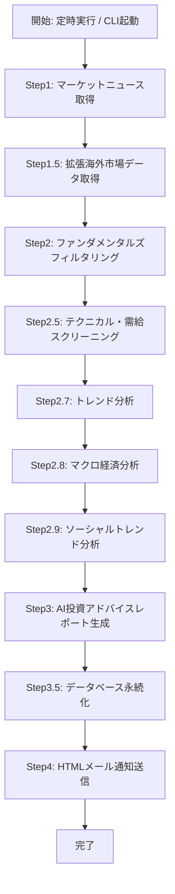

# 外部機能仕様書 (Functional Specification)

> **ドキュメントID**: SPEC-EXT-001  
> **対象システム**: 個人投資家向け投資判断支援ツール (Investment Decision Support Tool)  
> **最終更新日**: 2026-07-23

---

## 1. システム概要と目的

### 1.1 目的

本システムは、個人投資家が感情に左右されず、データとAIに基づいた客観的かつ体系的な投資判断を行えるよう支援するツールです。  
市場データ・マクロ指標・ファンダメンタルズ・テクニカル指標の自動収集およびスクリーニングから、AIによる景気フェーズ判定・アセットアロケーション提案、リスク管理（トレーリングストップ・出口シグナル診断）、投資結果の振り返り（投資日記）までを一貫してサポートします。

### 1.2 主なターゲットユーザー

- 日本株を取引する個人投資家
- スイングトレードおよび中長期投資を行う投資家
- マクロ経済指標やAI分析に基づき、データドリブンなアセットアロケーションを行いたいユーザー

---

## 2. 機能一覧

| 機能グループ           | 機能名称                        | 概要                                                                                   | 提供形式           |
| ---------------------- | ------------------------------- | -------------------------------------------------------------------------------------- | ------------------ |
| **ユーザー認証**       | ログイン / ログアウト           | JWTトークンに基づく安全な認証管理とユーザーセッション制御                              | Web UI / API       |
| **Webダッシュボード**  | マクロ環境・トレンド可視化      | 最新のマクロ景気フェーズ、推奨アロケーション、買い環境スコア、ソーシャルトレンドの表示 | Web UI             |
|                        | 市場アノマリー情報              | 季節性・カレンダー要因に関する参考情報の閲覧・登録・編集・削除                         | Web UI             |
|                        | 推奨銘柄リスト                  | AI/バッチにより厳選されたスクリーニング銘柄の比較・閲覧                                | Web UI             |
|                        | エントリー中銘柄（リスク管理）  | 保有ポジション一覧、損切ライン切り上げ、出口シグナル（危険/警告）表示                  | Web UI             |
|                        | テクニカルチャート分析          | 株価推移チャート、移動平均線、RSI、MACD、ボリンジャーバンドの表示と対話的分析          | Web UI             |
|                        | 運用状況・投資日記              | 売買履歴の記録、投資判断メモの記述、パフォーマンス（損益）計算、CSV出力                | Web UI             |
|                        | 過去のAIレポート                | 配信された日次AI分析レポートのアーカイブ閲覧および検索                                 | Web UI             |
| **ツール・計算機能**   | ポジションサイジング機能        | 運用状況の元本・損切幅に応じた最適推奨株数の自動算出                                   | Web UI (取引記録メモ) |
| **ワークフローバッチ** | データ自動収集 & スクリーニング | 外部データソースからの株価・財務・マクロ指標データ取得と指標フィルタリング             | バックエンド / CLI |
|                        | AI 景気・トレンド分析           | Google Gemini / Claude を活用したマクロ分析およびX/Googleトレンド影響レポート生成      | バックエンド / CLI |
|                        | 結果保存 & メール通知           | 分析結果のデータベース保存と、フォーマット済みHTMLメール送信                           | バックエンド / CLI |
| **ユーザー管理**       | アカウント作成 CLI              | システム管理者がダッシュボード用ログインアカウントを追加・管理するユーティリティ       | CLI                |

---

## 3. 画面・機能詳細仕様

### 3.1 ユーザー認証機能

- **ログイン画面**:
  - ユーザー名およびパスワードを入力して認証を行います。
  - 認証成功時、サーバーより発行されたJWTトークンをローカルストレージ（`localStorage`）へ保存し、ダッシュボード画面へ遷移します。
- **セッション維持・ログアウト**:
  - API呼び出し時にはヘッダーに `Authorization: Bearer <token>` を自動付与します。
  - ログアウトボタン押下でトークンを削除し、未ログイン状態へ復帰します。

### 3.2 Webダッシュボード画面

#### 3.2.1 マクロ環境・ダッシュボード (`Dashboard.jsx`)

- **マクロ経済環境表示**:
  - 現在の景気フェーズ（回復期、拡大期、成熟期、後退期など）、推奨アセットアロケーション比率（株式/現金/債券等）を表示。
- **買い環境スコアカード**:
  - VIX・25日騰落レシオ・信用評価損益率・マクロフェーズの4指標を統合した「今日は買えるか」を示す100点満点のスコアと、5段階ラベル（絶好の買い場〜買い見送り推奨）をメーター形式で表示。各指標の内訳スコアも併記（詳細は4.8.1）。
- **主要市場指数サマリー**:
  - 日経平均、TOPIX、S&P500、ドル円為替レート等の最新値・前日比。
- **ソーシャルトレンド分析**:
  - X（旧Twitter）やGoogle検索トレンドにおける日本株関連ワードのセンチメント（強気/弱気）とAI解説。
- **市場アノマリー情報**:
  - 1月効果、Sell in May、節分天井・彼岸底など、経験則として知られる季節性・カレンダー要因（アノマリー）の一覧をカード表示。分類、対象期間、説明、発生確率、対象アセットクラスを保持し、ユーザー自身が登録・編集・削除できる（AIやバッチによる自動生成ではなく、ユーザーが管理する参考情報）。

#### 3.2.2 推奨銘柄画面 (`Recommendations.jsx`)

- **一覧表示項目**: 銘柄コード、銘柄名、セクター、トレード区分、シグナル、スコア、推奨価格、現在値、騰落率、目標株価、損切ライン。行を選択するとAIコメント（推奨理由・テクニカル分析の解釈）を表示。
- **フィルター・ソート**: セクター別絞り込み、スコア・騰落率等の指標に基づく並び替え。
- **アクション**: 該当銘柄を「取引記録・意思決定メモ」でエントリー記録・数量決定（エントリー済みの場合はボタン表示が「エントリー中」に切り替わる）、または「チャート」を表示。

#### 3.2.3 エントリー中銘柄画面 (`Performance.jsx`)

- **保有ポジション表示**:
  - 銘柄名、取得単価、現在値、株数、評価損益、目標株価、損切ラインを表示。
- **トレーリングストップ機能**:
  - 現在値の更新に応じて、過去最高値からの落とし幅（指定%）に基づく推奨損切ラインを自動計算・表示。
- **出口シグナル診断**:
  - 以下の条件に合致した場合、警告バッジ（赤：要売り / 黄：注意）を表示。
    - **目標株価到達**: 現在値 ≧ 目標株価
    - **損切り到達**: 現在値 ≤ 損切設定値
    - **RSI過熱**: 14日RSI ≧ 70 (買われすぎ) または ≦ 30 (売られすぎ)
    - **決算前警戒**: 決算発表予定日まで3日以内

#### 3.2.4 テクニカルチャート分析画面 (`ChartAnalysis.jsx`)

- **表示機能**:
  - 対象銘柄の株価推移チャート（終値ベースの折れ線グラフ、出来高の棒グラフ表示付き）
  - 移動平均線（5日、25日）
  - ボリンジャーバンド（±2σ）
  - 推奨価格・エントリー価格・目標株価・損切ラインの水平線表示
  - サブチャート：RSI (14日)、MACD
- **対話操作**:
  - 期間切替（1ヶ月、3ヶ月、6ヶ月、1年）
  - 指標の表示/非表示トグル

#### 3.2.5 運用状況・投資日記画面 (`Trades.jsx`)

- **取引記録一覧**:
  - 約定日、銘柄コード、売買種別（買/売）、株数、単価、実現損益、投資理由メモ。
- **投資日記機能**:
  - 各取引に対する「エントリー理由」「エグジット理由」「反省点・振り返り」を自由テキストで記録。
- **CSVデータエクスポート**:
  - 登録された全取引履歴を標準CSV形式でダウンロード可能。

#### 3.2.6 過去のAIレポート画面 (`Reports.jsx`)

- **アーカイブ参照**:
  - 日次ワークフローで生成された過去のAIレポート一覧を日付順に表示。
- **詳細閲覧**:
  - レポートを選択して、生成されたHTML/Markdownテキスト（景気判断、注目セクター、スクリーニング結果詳細）を表示。

---

### 3.3 ポジションサイジング機能 (`MemoModal.jsx`)

投資家が1回の取引で取るリスク量を一定に保つための適切な購入株数計算機能です。「取引記録・意思決定メモ」モーダル内に統合されています。

- **入力・参照パラメータ**:
  1. 運用状況の投資元本 (JPY) - ユーザーの資産設定より自動参照
  2. 1取引あたりの許容リスク率 (1.0% ルール固定)
  3. エントリー予定株価 (JPY)
  4. 損切り設定株価 (JPY)
- **計算・出力項目**:
  - **1株あたりリスク幅**: `エントリー株価 - 損切り株価`
  - **推奨購入株数**: `Math.floor((元本 × 0.01 / 1株リスク幅) / 100) × 100` （単元100株調整）
- **表示仕様**:
  - 運用状況の元本が登録されている場合、「エントリー価格 (円)」の横に `(推奨: X,XXX株)` を動的表示。
  - 元本が未登録または0円の場合は推奨株数を「未表示」（非表示）。
  - **推奨購入株数**: `許容最大損失額 / 1株あたりリスク幅`（単元株数 100株単位で切り捨て調整）
  - **必要投資金額**: `推奨購入株数 × エントリー株価`
  - **ポートフォリオ占有率**: `必要投資金額 / 総資産額 × 100 (%)`

---

## 4. 自動分析・通知ワークフローバッチ仕様

バックエンドで定期実行またはCLIから呼び出される、日本株のスクリーニングとAI分析・メール通知を行う自動化ワークフローです。日本時間 8:30 / 12:00 / 15:00 の指定時刻に自動起動し、取引開始前（前場寄せ前）・日中（後場寄せ前）・大引け前の適切なタイミングで投資情報を提供します。

### 4.1 ワークフロー処理ステップ

```mermaid
flowchart TD
    A[開始: 定時実行 / CLI起動] --> B[Step1: マーケットニュース取得]
    B --> C[Step1.5: 拡張海外市場データ取得]
    C --> D[Step2: ファンダメンタルズフィルタリング]
    D --> E[Step2.5: テクニカル・需給スクリーニング]
    E --> F[Step2.7: トレンド分析]
    F --> G[Step2.8: マクロ経済分析]
    G --> H[Step2.9: ソーシャルトレンド分析]
    H --> I[Step3: AI投資アドバイスレポート生成]
    I --> J[Step3.5: データベース永続化]
    J --> K[Step4: HTMLメール通知送信]
    K --> L[完了]
```

> 各処理ステップの実行有無は、後述の「実行モード」（4.2.2）によって切り替わります。

### 4.2 実行判定（時間帯・実行モード）

ワークフローは引数 `--time`（時間帯）および `--mode`（実行モード）によって、分析対象の市場タイミングと処理範囲を切り替えます。

#### 4.2.1 時間帯キー

引数省略時は、実行時の日本時間（JST）から以下のように自動判別されます。

| 時間帯キー | 実行想定時刻 | 判定ルール（JST） | 配信の狙い                                                   |
| :--------- | :----------: | :---------------- | :----------------------------------------------------------- |
| `morning`  |     8:30     | 5:00〜10:29       | 前日の海外動向・朝ニュースを反映した前場寄り付き前の戦略     |
| `noon`     |    12:00     | 10:30〜13:29      | 前場の値動き・出来高を反映した後場寄り付き前の戦略           |
| `evening`  |    15:00     | 13:30〜翌4:59     | 終日の値動き・大引け出来高を確定させた引け買い・翌営業日戦略 |

#### 4.2.2 実行モード

システム負荷・API利用コストの削減のため、役割分担された3種類の実行モードを持ちます。

| モード名                | 頻度                     | 実行内容                                                                   | 配信メールの構成                         |
| :---------------------- | :----------------------- | :------------------------------------------------------------------------- | :--------------------------------------- |
| `macro`（`daily`）      | 日次バッチ（1日1回）     | 海外市場データ・トレンド・マクロ・ソーシャルトレンドの分析および保存       | トレンド＆マクロ要約のみ                 |
| `recommend`（`stocks`） | 推奨銘柄バッチ（1日3回） | 銘柄スクリーニングとAI個別銘柄分析（直近のマクロ分析結果を引き継いで使用） | AI個別銘柄投資アドバイスレポートのみ     |
| `full`（デフォルト）    | 統合実行（後方互換用）   | マクロ／トレンド分析と個別株スクリーニングを一括実行                       | マクロ・トレンドサマリー＋個別株レポート |

#### 4.2.3 モード別処理ステップ対応

| ステップ | 処理内容                         | 担当モジュール             |        macro        |         recommend         |    full     |
| :------- | :------------------------------- | :------------------------- | :-----------------: | :-----------------------: | :---------: |
| Step1    | マーケットニュース取得           | `data-provider.js`         |          ○          |             ○             |      ○      |
| Step1.5  | 拡張海外市場データ取得           | `data-provider.js`         |          ○          |       （DB引継ぎ）        |      ○      |
| Step2    | ファンダメンタルズフィルタリング | `screener.js`              |          -          |             ○             |      ○      |
| Step2.5  | テクニカル・需給スクリーニング   | `screener.js`              |          -          |             ○             |      ○      |
| Step2.7  | トレンド分析                     | `trend-analyzer.js`        |          ○          |       （DB引継ぎ）        |      ○      |
| Step2.8  | マクロ経済分析                   | `macro-analyzer.js`        |          ○          |       （DB引継ぎ）        |      ○      |
| Step2.9  | ソーシャルトレンド分析           | `stock-impact-analyzer.js` |          ○          |       （DB引継ぎ）        |      ○      |
| Step3    | AI投資アドバイスレポート生成     | `analyzer.js`              |          -          |             ○             |      ○      |
| Step3.5  | データ永続化                     | `db.js`                    |          ○          | ○（マクロ等も引継ぎ保存） |      ○      |
| Step4    | メール通知送信                   | `notifier.js`              | ○（マクロ要約のみ） |      ○（個別株のみ）      | ○（合体版） |

### 4.3 データ収集仕様

- 複数の外部データソース（株価・財務情報サイト、マクロ経済統計データ提供元等）から、独自のWebスクレイピングおよび軽量なHTTPリクエストによりデータを取得します（公式APIの機能制限・依存関係を回避するため）。
- BOT検出やアクセス制限を回避し安定動作を確保するため、ヘッドレスブラウザによる自動化と、軽量なHTTPリクエストを組み合わせたハイブリッド設計を採用しています。
- **リトライ＆クールダウン**: 一時的な通信エラー・タイムアウト発生時は最大3回まで再試行し、失敗ごとに待機時間を段階的に延長します（1回目失敗後3秒 → 2回目失敗後6秒 → 3回目失敗後9秒）。
- **主な取得データ**:
  - ニュース: ビジネス・経済カテゴリの最新ニュース見出し15件
  - 個別銘柄: 過去40営業日分の日足四本値、PER、PBR、ROE、配当利回り、自己資本比率、信用倍率、決算発表予定日
  - 海外市場・マクロ指標: S&P500、NASDAQ、米10年債利回り、VIX指数、金、原油、ドルインデックス（DXY）、ビットコイン、銅、ドル円レート、日本国債金利、実質金利、期待インフレ率、消費者物価指数（CPI）、失業率、非農業部門雇用者数（NFP）、消費者マインド指数、米2年債金利
  - 日本株市場シグナル: 日経平均予想PER、25日騰落レシオ、日本国債10年利回り（フォールバック用）、信用評価損益率（これらから株式益回り・株式イールドスプレッドを算出）

#### 4.3.1 対象銘柄（ユニバース）の選定方法

スクリーニングの対象となる銘柄群（ユニバース）は、以下のいずれかの方法で決定されます。

- **動的取得**: 売買代金ランキング上位200銘柄を対象として動的に取得します。市況に応じて話題性・流動性の高い銘柄を柔軟に取り込むための方式です。
- **固定リスト**: 動的取得を行わない場合は、あらかじめ設定ファイルに指定された銘柄リストを対象としてスクリーニングを行います。

### 4.4 ファンダメンタルズフィルタリング仕様

テクニカルスクリーニングの前段として、企業財務・需給状況をチェックし、最低限の健全性を保証するハード・フィルタリングを行います。

- 銘柄ごとに1.5〜3.0秒のランダムな待機を挟んで財務指標を取得します。
- 定義済みの閾値と比較し、1つでも基準を満たさない指標があれば除外（FAILED）と判定します。
- 通信エラーやデータ未存在等で指標が取得できなかった場合は、機会損失を防ぐためデフォルトで通過（PASSED）扱いとします。

| 指標                  | 判定条件             | デフォルト設定値 | 目的・意味                                         |
| :-------------------- | :------------------- | :--------------: | :------------------------------------------------- |
| PER（予想）           | 上限を超えたら除外   | **null（無効）** | 割高な銘柄を排除する                               |
| PBR（実績）           | 上限を超えたら除外   | **null（無効）** | 資産価値に対して割高な銘柄を排除する               |
| 配当利回り            | 下限を下回ったら除外 | **null（無効）** | インカムゲインの低い銘柄を排除する                 |
| 自己資本比率          | 下限を下回ったら除外 |  **20.0%以上**   | 過度な債務超過・倒産リスクを回避する               |
| ROE（自己資本利益率） | 下限を下回ったら除外 |   **5.0%以上**   | 経営効率・資本効率の極めて悪い銘柄を排除する       |
| 信用倍率              | 上限を超えたら除外   |  **5.0倍以下**   | 信用買残が積み上がりすぎた将来の売り圧力を排除する |

> 出来高急増ランキング等から動的に取得するグロース株・テーマ株は、成長期待からPER・PBRが高騰しやすく配当を出さない銘柄が多いため、PER・PBR・配当利回りのフィルタはデフォルトで無効化されています。自己資本比率・ROE・信用倍率といった必須の健全性指標のみを最低限チェックする設計です。

### 4.5 テクニカル・需給スクリーニング仕様

ファンダメンタルズフィルタを通過した銘柄を対象に、テクニカル指標および需給シグナルの両面からスコアリング（加点方式・最大35点・ペナルティあり）を行い、総合的な「買いシグナル候補」を選定します。

#### 4.5.1 算出指標と対象除外ルール

- 銘柄ごとに過去40営業日分の日足データを基に、RSI(14)、25日移動平均線（SMA25）・乖離率、出来高倍率、MACD(12/26/9)、ボリンジャーバンド（20日・2σ）、ATR(14) を計算します。
- **上場廃止・取引停止の除外**: 取得した最新の日足の日付が実行時（本日）から8日以上古い場合、上場廃止や取引停止の可能性が高いため、スクリーニング対象から自動的に除外します。

#### 4.5.2 スコアリングルール

##### 基本シグナル

|       区分       | スコア加点 | 検知条件                                                                             | 投資判断上の意味・狙い                                                                     |
| :--------------: | :--------: | :----------------------------------------------------------------------------------- | :----------------------------------------------------------------------------------------- |
|  **テクニカル**  |  **+3点**  | RSI売られすぎ（`RSI <= 35`）                                                         | 短期的な過売り状態による逆張り（自律反発狙い）の買いシグナル。                             |
|  **テクニカル**  |  **+2点**  | 出来高急増（`出来高倍率 >= 1.5`）                                                    | 取引急増によるトレンド転換やブレイクアウトの初期シグナル。                                 |
|  **テクニカル**  |  **+2点**  | 25日移動平均線下方乖離大（`乖離率 <= -5%`）                                          | 平均からの乖離に伴う短期的な自律反発の狙い目。                                             |
|  **テクニカル**  |  **+1点**  | 当日の急激な値動き（`\|前日比率\| >= 3%`）                                           | ボラティリティ上昇による短期資金の流入。                                                   |
|  **テクニカル**  |  **+1点**  | RSI高値警戒/強気トレンド（`RSI >= 65`）                                              | 順張り（モメンタム）における上昇トレンド継続。                                             |
| **需給（信用）** |  **+1点**  | 信用倍率1倍割れ/売り長（`信用倍率 < 1.0`）                                           | 信用売残が買残を上回っており、将来の買い戻し（上昇要因）が期待できる。                     |
| **需給（信用）** |  **+2点**  | 踏み上げ期待シグナル（`信用倍率 <= 0.5` かつ `出来高比 >= 1.5` かつ `前日比プラス`） | 極端な売り長状態で出来高を伴って上昇し始めており、ショートスクイーズ（踏み上げ）が狙える。 |
| **需給（信用）** |  **+1点**  | 信用買残の減少トレンド（前週比で買残が `-10%` 以下）                                 | 過去信用データと比較し、しこり玉（整理売り）が整理進行して上値が軽くなっている。           |
|  **テクニカル**  |  **+1点**  | 短期トレンド継続（`SMA5上向き` かつ `現在値 > SMA5`）                                | 短期の大局トレンドが上昇局面にあり、現在値がそのトレンド線を上回っている短期順張り環境。   |
|  **テクニカル**  |  **+1点**  | 短期ブレイクアウト（`当日終値 > 直近5営業日高値`）                                   | 押し目形成後の短期高値更新。短期トレンド継続の初動を検知する。                             |

##### 追加シグナル（MACD・ボリンジャーバンド・ATR/RR比）

|          区分          | スコア加点 | 検知条件                                                     | 投資判断上の意味・狙い                                                                                         |
| :--------------------: | :--------: | :----------------------------------------------------------- | :------------------------------------------------------------------------------------------------------------- |
|        **MACD**        |  **+3点**  | MACDゴールデンクロス（MACD線がSignal線を下から上抜け）       | モメンタムが下降から上昇に転換したトレンド転換の確認シグナル。RSIと組み合わせで逆張り精度が大幅向上。          |
|        **MACD**        |  **-2点**  | MACDデスクロス（MACD線がSignal線を上から下抜け）             | 下降モメンタムへの転換を示す警戒シグナル。ペナルティとして減算。                                               |
| **ボリンジャーバンド** |  **+2点**  | ボリンジャーバンド下限タッチ（`終値 <= 下限バンド`）         | 統計的に過売りとなった状態。バンド内への回帰（平均回帰）による自律反発が期待できる。                           |
| **ボリンジャーバンド** |  **+2点**  | BBスクイーズ＋下限ブレイク（`バンド幅 < 5%` かつ下限タッチ） | ボラティリティが極端に収縮した後のブレイクアウト前兆。噴火（急騰）前のトリガーとなるパターン。                 |
|      **ATR/RR比**      |  **+2点**  | ATRベースRR比 >= 2.0（`報酬 / リスク >= 2.0`）               | ATR×1.5を損切り、ATR×3.0を目標とした場合のリスクリワード比が良好。費用対効果の高いトレードのみを優先選択する。 |

##### 複合ボーナスシグナル

複数の強いシグナルが一致した場合にボーナス点を加算し、高信頼パターンを優先的に抽出します。

|       区分        | ボーナス点 | 発動条件                                                                 | 狙い                                                                         |
| :---------------: | :--------: | :----------------------------------------------------------------------- | :--------------------------------------------------------------------------- |
| **複合パターン1** |  **+3点**  | RSI≤30 ＋ MACDゴールデンクロス ＋ 出来高急増（3点セット）                | 最高精度の反転シグナル（逆張りの王道）                                       |
| **複合パターン2** |  **+2点**  | ボリンジャー下限タッチ ＋ RSI≤30                                         | 統計的極端売られすぎ                                                         |
| **複合パターン3** |  **+2点**  | 信用売り長 ＋ 出来高急増 ＋ 株価上昇（前日比プラス）                     | ショートスクイーズ高確率パターン                                             |
| **複合パターン4** |  **+2点**  | SMA25乖離≤-10% ＋ MACDゴールデンクロス                                   | 大乖離から反発タイミングが一致                                               |
| **複合パターン5** |  **+1点**  | MACDゴールデンクロス ＋ 中期トレンド継続（SMA52上向き＋現在値がSMA52超） | モメンタム転換とトレンド持続が一致した高確度の順張りトレンドフォローシグナル |
| **複合パターン6** |  **+1点**  | 短期上昇トレンド ＋ 出来高急増 ＋ 株価上昇（前日比プラス）               | 短期順張りモメンタム高確率パターン                                           |

##### 週足トレンドフィルター・決算スケジュール回避

|            区分            | スコア加点 | 検知条件                                                   | 投資判断上の意味・狙い                                                                                                                                                                                                                                                                                                      |
| :------------------------: | :--------: | :--------------------------------------------------------- | :-------------------------------------------------------------------------------------------------------------------------------------------------------------------------------------------------------------------------------------------------------------------------------------------------------------------------- |
| **週足トレンドフィルター** |  **-1点**  | `SMA52（中期移動平均）が下向き` ＋ `RSI売られすぎ（<=35）` | 中期の大局トレンドが下降局面にある中での逆張り（RSI売られすぎ）シグナルにペナルティを課し、「下降トレンド中のナンピン買い」を抑制する。SMA52は取得可能な日足データ点数から算出（最大52営業日・最小25営業日）した中期移動平均線を代理指標とし、直近5日間の傾きで方向を判定する。                                             |
|  **決算スケジュール回避**  |  **なし**  | `直近10日以内に決算発表予定がある`                         | 決算発表による株価急変動リスクを回避するため、対象銘柄に決算警告フラグを付与する（減点は行わない）。決算発表予定日は個別銘柄ページから直接スクレイピング取得した値を使用するため、固定カレンダーの手動メンテナンスが不要で、動的ユニバース銘柄にも対応する。取得日付は推奨銘柄画面（3.2.2）の決算警告表示にも再利用される。 |

##### 中期・順張り系シグナル

短期の逆張り系シグナルに比べ、中期・順張り系の加点シグナルが少なくスコア上位を短期候補が占有しやすい偏りがあったため追加された補完シグナルです。

|          区分          | スコア加点 | 検知条件                                         | 投資判断上の意味・狙い                                                                                 |
| :--------------------: | :--------: | :----------------------------------------------- | :----------------------------------------------------------------------------------------------------- |
|  **中期トレンド継続**  |  **+1点**  | `SMA52が上向き` ＋ `現在値がSMA52を上回る`       | 中期の大局トレンドが上昇局面にあり、現在値がそのトレンド線を上回っている「地合いの良い」順張り環境。   |
| **中期ブレイクアウト** |  **+1点**  | `当日終値が直近20営業日高値（当日を除く）を更新` | 押し目形成後の高値更新。出来高急増を伴わない静かなブレイクアウトも含め、トレンド継続の初動を検知する。 |

##### 相対強度（レラティブストレングス）

個別銘柄の絶対的な値動き（RSI・移動平均乖離等）だけでは、市場全体が下落する中での「ただ弱いだけ」の銘柄と、真に自律反発が期待できる銘柄を区別できないため、ベンチマーク（TOPIX連動ETF、`1306.T`）に対する相対的な強弱を加味します。

- **算出方法**: 相対強度20d = 対象銘柄の直近20営業日騰落率 − ベンチマークの直近20営業日騰落率（単位: パーセンテージポイント）。ベンチマーク自体の騰落率はスクリーニング開始時に1回だけ取得します。

|          区分          | スコア加点 | 検知条件                                          | 投資判断上の意味・狙い                                                                                                                                  |
| :--------------------: | :--------: | :------------------------------------------------ | :------------------------------------------------------------------------------------------------------------------------------------------------------ |
|    **相対強度良好**    |  **+1点**  | `相対強度20d >= +10pt`                            | ベンチマークに対して継続的にアウトパフォームしており、トレンドフォローの根拠となる（中期側に加算）。                                                    |
| **相対強度フィルター** |  **-1点**  | `相対強度20d <= -10pt` ＋ `RSI売られすぎ（<=35）` | 市場対比で大幅に劣後している中でのRSI売られすぎは、市場全体の調整に連動しただけでなく銘柄固有の弱さである可能性が高いためペナルティ（短期側から減算）。 |

> ベンチマークデータが取得できなかった場合は本シグナルによる加減点は行われません（フェイルオープン）。

##### 勝率補正・下降ナイフペナルティ・信用しこり度・区分別ATR

選定精度およびリスク対報酬バランスを最大化するための追加ロジックです。

|              区分              |  スコア加点  |                                             検知条件                                              | 投資判断上の意味・狙い                                                                                                                                 |
| :----------------------------: | :----------: | :-----------------------------------------------------------------------------------------------: | :----------------------------------------------------------------------------------------------------------------------------------------------------- |
|   **単独RSI下降ペナルティ**    |   **-3点**   |       `強気下降トレンド（SMA52下向き かつ SMA25乖離率<=-5%）` ＋ `RSI<=35`（反転指標なし）        | 裏付けシグナル（MACD GC・BB下限・出来高急増など）がない「落ちてくるナイフ」を回避するためペナルティを大幅強化。                                        |
| **信用買残しこり度ペナルティ** |   **-1点**   |                              `信用買残 ÷ 直近5日平均出来高 >= 10.0`                               | 日々の出来高に対して信用買残が過大（10日分以上）に蓄積しており、戻り売り圧力が極めて強い銘柄を排除する。                                               |
|    **動的シグナル勝率補正**    | **0.5x補正** |                    `確定トレード数 >= 5件` かつ `当該シグナルの通算勝率 < 40%`                    | 過去実績を参照し、直近不調なシグナルの加点影響力を自動的に半分に緩和する動的フィードバック。                                                           |
|    **区分別ATR・RR比判定**     |   **+2点**   | トレード区分ごとの目標/損切り設定（短期: 損切1.0x/目標1.5x、中期: 損切2.0x/目標4.0x）でRR比クリア | トレード区分ごとの特性に合わせ、短期なら小幅な戻り売り目標（RR>=1.2）、中期ならトレンド伸長目標（RR>=1.8）で最適化されたリスクリワード比を判定・加点。 |

##### 強気ダイバージェンス・出来高プロファイル・地合い連動補正

トレードアドバイザーとしての精度・安全性を高めるための追加シグナルおよび価格ターゲット調整です。

|               区分               | スコア加点 |                                           検知条件                                           | 投資判断上の意味・狙い                                                                                       |
| :------------------------------: | :--------: | :------------------------------------------------------------------------------------------: | :----------------------------------------------------------------------------------------------------------- |
|     **強気ダイバージェンス**     |  **+3点**  |     株価が直近安値を更新し切り下がっている中、RSI(14)が前回の安値より高い（切り上がり）      | オシレーターのダイバージェンス現象を検知。安値圏での下落モメンタム減衰と強力な反転（底打ち）を事前に捉える。 |
|      **出来高サポート領域**      |  **+1点**  |  直近40営業日の価格帯別出来高で、現在値の直下（0〜-7%範囲）に累計20%以上の集中ノードが存在   | 過去に活発に取引された価格帯が下値支持線（強力なサポート）として機能することが期待できる。                   |
|     **出来高抵抗ペナルティ**     |  **-1点**  |  直近40営業日の価格帯別出来高で、現在値の上値（0〜+15%範囲）に累計20%以上の集中ノードが存在  | 過去の出来高溜まりが戻り売り圧力（しこり玉の壁）となり、上値が重くなるリスクを警戒してペナルティ減点。       |
| **全体相場地合い逆行ペナルティ** |  **-1点**  | ベンチマーク（TOPIX ETF）の25日移動平均線が下向きの状況で、RSI売られすぎ等の逆張りを行う場合 | 相場全体の下降トレンドに逆らう単独逆張りリスクを警戒し減点。                                                 |

> **Swing High / Swing Low による目標・損切り価格の安全補正**: 機械的な `ATR × N` で算出された損切り価格が直近20営業日の安値（Swing Low）の直上にある場合、ヒゲ刈りを避けるため `Swing Low × 0.99`（直近安値の1%下）へ補正します。同様に、目標株価が直近20営業日の高値（Swing High）を超える場合は、手堅い利確のために `Swing High × 0.99`（直近高値の1%下）に第一目標をアジャストします。

#### 4.5.3 ATRに基づく損切り・目標株価（トレード区分別）

確定したトレード区分（`tradeHorizon`）に応じて、ATR(14)から利確・損切りラインを自動算出します。

| トレード区分             | 損切りライン       | 目標株価           | RR比加点基準 | 特徴・狙い                                   |
| :----------------------- | :----------------- | :----------------- | :----------- | :------------------------------------------- |
| 短期（`short`）          | 現在値 − ATR × 1.0 | 現在値 + ATR × 1.5 | RR >= 1.2    | 自律反発狙い。小さく取って早めに手仕舞う     |
| 中期（`mid`）            | 現在値 − ATR × 2.0 | 現在値 + ATR × 4.0 | RR >= 1.8    | トレンド伸長狙い。ゆったり保有して利益最大化 |
| 複合（`mixed`）          | 現在値 − ATR × 1.5 | 現在値 + ATR × 2.5 | RR >= 1.5    | 短期〜中期のバランス型                       |
| 未分類（`unclassified`） | 現在値 − ATR × 1.5 | 現在値 + ATR × 3.0 | RR >= 2.0    | 標準ATRターゲット                            |

これらの値はAI分析（4.11）にも渡され、損切り・目標価格の数値根拠として参照されます。

#### 4.5.4 フィルタリングとソート

1. **閾値フィルタ**: スコアが1点以上の銘柄のみを抽出します（1つのシグナルも検知していない銘柄は除外）。
2. **短期・中期バランス抽出**: 単純に総合スコア順でソートすると、シグナル数が多くなりやすい「中期（順張り）」銘柄が上位を独占し、短期銘柄が埋もれてしまう問題を避けるため、トレード区分ごとに個別抽出を行います。スクリーニング最大件数（デフォルト15件）に対し、短期・中期からそれぞれ最大7件（`floor(最大件数/2)`）をグループ内の総合スコア順（同点時は出来高倍率順）に抽出し、残りの枠は複合・判定不可を含む全候補から総合スコア順で充填します。
3. **最終ソート**: 抽出した銘柄リストは、最終的に総合スコアが高い順（降順）に並び替えて返却されます。

#### 4.5.5 トレード区分（短期／中期）ラベリング

各シグナルを「短期（逆張り）」「中期（順張り）」のいずれかに分類し、優勢な方を銘柄ごとの想定トレード区分として判定します。

- **短期寄りシグナル**: RSI売られすぎ、SMA25下方乖離、BB下限タッチ/スクイーズ、信用倍率1倍割れ、踏み上げ期待、複合パターン1〜4、週足トレンドフィルターのペナルティ、短期トレンド継続、短期ブレイクアウト、複合パターン6
- **中期寄りシグナル**: RSI強気トレンド、MACDゴールデンクロス（デスクロスはペナルティ）、信用買残の減少トレンド、中期トレンド継続、中期ブレイクアウト、複合パターン5、相対強度良好
- 出来高急増・当日急変動・ATRベースRR比のように方向性を持たないシグナルはどちらにも加算されません。

| 条件                                                | トレード区分   | 表示ラベル         | 想定保有期間の目安 |
| :-------------------------------------------------- | :------------- | :----------------- | :----------------- |
| 短期スコアと中期スコアが両方0（方向性シグナルなし） | `unclassified` | 判定不可           | なし               |
| 短期スコア > 中期スコア                             | `short`        | 短期（逆張り）     | 数日〜1週間程度    |
| 中期スコア > 短期スコア                             | `mid`          | 中期（順張り）     | 数週間〜数ヶ月程度 |
| 同点（かつどちらか0より大きい）                     | `mixed`        | 短期〜中期（複合） | 数日〜数週間程度   |

判定結果は「トレード区分」バッジとして推奨銘柄画面（3.2.2）・エントリー中銘柄画面（3.2.3）に表示されるほか、AI分析（4.11）にも想定トレード区分として渡され、AIが想定保有期間や利確・損切りの考え方（短期なら早めの手仕舞い、中期ならトレンド継続を重視）に言及するよう指示されます。

#### 4.5.6 ポジションサイジング計算仕様

個人投資家の資金管理（1%ルール）に基づき、スクリーニングされた各銘柄について単元100株単位調整後の最適購入株数・投入金額・最大損失額を、3.3節と同じ計算式（デフォルト: 運用総資金300万円・許容リスク比率1.0%）で自動算定します。推奨株数が100株未満（0株）となる高値株・広損切幅の銘柄には、「最低100株購入時の必要資金・想定リスク」の警告注記が付与されます。

#### 4.5.7 エントリー戦術・トレーリングストップガイダンス仕様

エントリー注文種別の自動判定と、株価上昇に伴いリスクを段階的に解消・利益確定する3段階トレーリングストップステップを生成します。

- **エントリー戦術分類**:
  - **ブレイクアウト買い**: 高値更新時に直近高値上抜けで逆指値エントリー。
  - **押し目・引きつけ買い**: 乖離率・BB下限タッチ時にSMA5/サポート線付近まで引きつけて指値エントリー。
  - **打診買い**: 標準局面での寄り付き・成行分散エントリー。
- **トレーリングストップステップ**:
  - **Step 1（エントリー時）**: 初期ストップロスライン。
  - **Step 2（+1.0x ATR上昇時）**: 損切りラインを「買値（同値）」へ引き上げ（リスクゼロ化）。
  - **Step 3（+1.5x ATR上昇時）**: 損切りラインを「+0.75x ATR」へ引き上げ（利益確定を確保）。

これらのガイダンスは、エントリー中銘柄画面（3.2.3）の「トレーリングストップ機能」として表示されます。

#### 4.5.8 推奨銘柄ウォークフォワード追跡仕様

過去にアプリが推奨した銘柄のその後の経過（最高値・最安値・現在値・目標到達日・損切到達日）を日次バッチで自動追跡・集計します。

- **ステータス管理**: `tracking`（追跡中） / `target_hit`（🟢 目標達成） / `loss_hit`（🔴 損切到達）
- **パフォーマンス指標**: 通算勝率(%)、到達平均日数、平均騰落率(%)
- 集計結果はシグナル検証画面（`SignalPerformance.jsx`）に可視化されます。

### 4.6 経済イベント確認仕様

主要経済イベントスケジュール（FOMC、日銀会合、米CPI、米雇用統計、GDP等）を管理する軽量モジュールです。

- 実行時の日付から指定日数（デフォルト5日）以内に開催予定の、または直近2日以内に開催された経済イベントを検索します。
- 検出されたイベント一覧は、AI分析プロンプトへ埋め込むテキスト（例:「FOMC (2日後)」「日銀会合 (昨日)」）としてフォーマットされます。

### 4.7 トレンド分析仕様（センチメント・テーマ抽出）

ニュース・拡張された海外市場データを基に、Gemini APIを用いてセンチメント分析・テーマ抽出を行います。

- **入力**: 最新15件のニュース見出し、VIX・金・原油・DXY等を含む拡張海外市場データ、前回実行時のトレンドデータ（変化の比較用）
- **出力**: 市場センチメントスコア（-100〜+100）とラベル（強気／やや強気／中立／やや弱気／弱気）、センチメントの根拠、セクター別センチメント（最大6セクター）、注目キーワード（最大8件）、景気フェーズ名（拡張期／減速期／後退期／回復期／判断保留）とその根拠、主要指標のトレンド方向、推奨セクター（最大3つ）、警戒セクター（最大2つ）、マクロ環境の総括
- 生成結果はメール本文冒頭のサマリーとして結合されます。

### 4.8 マクロ経済分析仕様

拡張海外指標、イベント情報、前回マクロデータから景気サイクル、逆イールド等の警戒シグナル、およびセクターローテーションをGemini APIで分析します。

- **入力**: 拡張された海外市場データ（VIX、2Y金利、金、原油、DXY等）と日本株市場シグナル（日経平均PER、25日騰落レシオ、株式イールドスプレッド、信用評価損益率）、直近の経済イベント一覧、前回実行時のマクロ分析結果、最新15件のマーケットニュース
- **出力**: 景気フェーズ名・詳細説明・投資戦略、類似する過去の相場局面、主要リスク要因、恐怖強欲指数（0〜100）とラベル、マクロアラート（逆イールド／VIX急騰／リスクオフ等、重要度付き）、米国債利回り差（10Y-2Y）、セクターローテーション推奨、警戒セクター、マクロ環境の総括、当日の取引で取るべき具体的アクション

#### 4.8.1 買い環境スコアカード

VIX・25日騰落レシオ・信用評価損益率・マクロフェーズの4つの市場シグナルを統合し、「今日は買えるか」を100点満点のスコアとラベルに数値化する機能です。

- **配点仕様（各指標25点満点、合計100点）**:
  いずれかの指標が未取得（`null` / `undefined`）の場合は、中立値として `12点` が付与されます。

  - **① VIX（恐怖指数）配点（25点満点）**
    低いほど市場が落ち着いており高得点となります。

    | 条件 | 配点 | 状態評価 |
    | :--- | :---: | :--- |
    | `VIX < 15` | **25点** | 非常に落ち着いた相場（安全領域） |
    | `15 <= VIX < 20` | **20点** | 概ね安定 |
    | `20 <= VIX < 25` | **15点** | やや警戒 |
    | `25 <= VIX < 30` | **8点** | ボラティリティ上昇警戒 |
    | `VIX >= 30` | **0点** | パニック・リスクオフ（危険領域） |
    | 未取得 / 不明 | **12点** | 中立 |

  - **② 25日騰落レシオ配点（25点満点）**
    売られすぎ（底値圏）ほど高得点、買われすぎ（過熱）ほど低得点となります。

    | 条件 | 配点 | 状態評価 |
    | :--- | :---: | :--- |
    | `ADR <= 70%` | **25点** | 極度の売られすぎ（大底圏・絶好の買い場） |
    | `70% < ADR <= 90%` | **18点** | やや売られすぎ |
    | `90% < ADR <= 120%` | **12点** | 適正範囲・中立 |
    | `120% < ADR <= 140%` | **5点** | 買われすぎ（過熱警戒） |
    | `ADR > 140%` | **0点** | 極度の買われすぎ（天井警戒） |
    | 未取得 / 不明 | **12点** | 中立 |

  - **③ 信用評価損益率配点（25点満点）**
    マイナス幅が大きい（個人含み損拡大）ほどセリングクライマックスとして高得点、0%近辺ほど低得点となります。

    | 条件 | 配点 | 状態評価 |
    | :--- | :---: | :--- |
    | `率 <= -15%` | **25点** | 個人含み損大（大底圏・絶好の買い場） |
    | `-15% < 率 <= -8%` | **18点** | やや冷え込み |
    | `-8% < 率 <= -3%` | **10点** | 普通 |
    | `率 > -3%` | **3点** | 利益確定売り・天井圏警戒 |
    | 未取得 / 不明 | **12点** | 中立 |

  - **④ マクロフェーズ配点（25点満点）**
    `phaseName`（景気フェーズ）に応じた配点テーブルです。

    | フェーズ (`phaseName`) | 配点 | 状態評価 |
    | :--- | :---: | :--- |
    | **拡張期** | **25点** | 景気拡大の強い追い風 |
    | **回復期** | **22点** | 景気回復局面 |
    | **判断保留** | **12点** | 中立 |
    | **減速期** | **10点** | 景気減速・慎重姿勢 |
    | **後退期** | **3点** | 景気後退・強めの逆風 |
    | 未設定 / 不明 | **12点** | 中立 |

| 合計スコア | ラベル         | 表示 |
| :--------: | :------------- | :--: |
|  75点以上  | 絶好の買い場   | 🟢🟢 |
|  55〜74点  | 買い場         |  🟢  |
|  35〜54点  | 中立           |  🟡  |
|  15〜34点  | 様子見推奨     |  🟠  |
|  14点以下  | 買い見送り推奨 |  🔴  |

このスコアカードは景気サイクルフェーズの直後にメーター表示と各指標の内訳スコアとしてメール本文・ダッシュボードに出力されます。

#### 4.8.2 マクロサマリーの動的アラート

- **VIX（恐怖指数）**: `vix.price >= 25` の場合にボラティリティ上昇警戒の補足コメントを出力。
- **騰落レシオ（25日平均）**: `adr25 >= 120` で買われすぎ（過熱）警戒、`adr25 <= 70` で売られすぎ（底入れ接近・買い場）の補足コメントを出力。
- **信用評価損益率（週次）**: `marginEvalRatio <= -15` で個人含み損拡大による大底圏（買い場）を示唆、`marginEvalRatio >= -3` で利益確定売りが出やすい天井圏（売り警戒）の補足コメントを出力。

### 4.9 ソーシャルトレンド分析仕様

AIのリアルタイムWeb検索（Google Search Grounding または Claude Web Search）を活用し、本日の日本の急上昇トレンドワード（Google）およびSNSトレンド（X）を取得した上で、日本株のセクターや特定銘柄への波及効果・影響度を分析します。

- **出力**: データ取得日時、Google急上昇検索ワード、Xトレンドワード、トレンドキーワードごとの影響方向（ポジティブ／ネガティブ／中立）・影響セクター・関連銘柄ティッカー・簡潔な解説、当日のトレンドが株式市場に与える総合的な影響の要約

### 4.10 AI共通クライアント仕様

Gemini API および Claude API の利用を抽象化し、型安全な構造化JSON出力やリアルタイムWeb検索グラウンディング機能を提供する共通クライアント層です。

- **プロバイダの透過的切り替え**: 設定（`AI_PROVIDER`: "gemini" または "claude"）を自動検知し、該当SDKでリクエストを送出します。
- **自動リトライ**: APIエラー（レートリミットやサーバーエラー）検知時、最大3回まで5秒の待機時間を設けて自動的に再試行します。
- **JSON Schema互換性変換**: Geminiのレスポンススキーマ形式を、Claude APIが求めるフォーマットへ自動変換して送信します。
- **Web検索グラウンディング（ソーシャルトレンド分析で使用）**:
  - Gemini利用時は、検索グラウンディングと構造化出力の同時使用が制限されているため、「検索・情報収集」→「構造化JSON抽出」の2ステップで処理します。
  - Claude利用時は、公式検索ツールとJSON Schema出力を同時に有効化し、単一のAPIコールで検索と構造化結果生成を行います（非対応モデルの場合は標準API呼び出しに自動フォールバック）。

### 4.11 AI投資アドバイスレポート生成仕様

- **使用モデル**: `gemini-3.6-flash`（Gemini利用時）
- **入力データ**: 実行時間帯（朝/昼/夕）ごとのマーケット定義、最新の経済ニュース15本、スクリーニングを通過した銘柄のテクニカルサマリー（現在値、前日比、RSI、出来高倍率、乖離率、検知理由、財務指標、信用倍率、想定トレード区分等）、マクロ経済分析（4.8）で得られた最新の構造化マクロデータ
- **アウトプット構成**:
  1. **市場トレンド・センチメント分析**: 直近の経済動向、今日の相場の雰囲気、AIによって判定されたマクロ経済分析結果（景気フェーズ、逆イールド状況、カレンダー要因等）を踏まえ、日本株市場への複合的な影響を論理的に解説
  2. **今エントリーするならベストと思われる銘柄**: スクリーニング結果から短期（逆張り）および中期（順張り）それぞれ最大2銘柄（設定変更可）を厳選し、「テクニカル分析の解釈」「具体的な推奨理由」「売買戦略（目安のエントリー価格、目標価格、損切り価格）」を生成。魅力的な銘柄がない場合は「推奨なし（様子見）」とする
  3. **全体のトレード戦略とアドバイス**: その時間帯に応じたトレードの注意点や資金管理のアドバイス
  4. **免責事項**: 投資の自己責任に関する定型文

### 4.12 結果保存・通知仕様

- **データ永続化**: 分析ステップごとの結果（トレンド分析、マクロ分析、ソーシャルトレンド分析、拡張海外市場データ）をスナップショット単位でPostgreSQLへ保存し、1日3回の推奨銘柄バッチ実行時に直近のマクロ・トレンドデータを引き継いで利用します。スクリーニング結果には、決算発表予定日、想定トレード区分・保有期間目安、相対強度（対TOPIX）等の付加情報も保存され、推奨銘柄画面・エントリー中銘柄画面のバッジ表示や決算警告表示に再利用されます。
- **通信プロトコル**: SMTP通信（`nodemailer` ライブラリを使用）
- **メールフォーマット**: HTMLメール（テキストフォールバック付き）
- **本文構成**: トレンド分析サマリー、マクロ経済分析レポート、個別銘柄の投資アドバイスレポートを結合した本文を送信します。
- **デザイン**: 視認性を重視したレスポンシブなカードデザイン。ヘッダーにはネイビーとブルーのグラデーションを配置し、見出しにアクセントボーダー・カラーを設定してスマートフォンでの可読性を向上させています。AIが生成したMarkdownテキストは、簡易パーサーを介してHTMLコンポーネントへ変換されます。

---

## 5. 外部連携・インターフェース仕様

| 連携先外部サービス                         | 接続プロトコル                                                 | 利用目的                                       | 主な取得・連携データ                                                                                                |
| ------------------------------------------ | -------------------------------------------------------------- | ---------------------------------------------- | ------------------------------------------------------------------------------------------------------------------- |
| **株価・財務情報サイト（国内）**           | HTTPS（Webスクレイピング）                                     | 日本株の株価・財務・信用残データ取得           | 日足四本値（過去40営業日）、PER、PBR、ROE、配当利回り、自己資本比率、信用倍率・信用残、決算発表予定日               |
| **株価・指数情報サイト（海外）**           | REST API（HTTPS）                                              | 海外市場・マクロ指標取得                       | S&P500、NASDAQ、米10年債利回り、VIX指数、金、原油、ドルインデックス（DXY）、ビットコイン、銅、ドル円レート          |
| **ニュース配信サイト（RSS）**              | HTTPS（RSS）                                                   | 国内マーケットニュース取得                     | ビジネス・経済カテゴリの最新ニュース見出し（最新15件）                                                              |
| **マクロ経済統計データ提供元（海外）**     | REST API（HTTPS）                                              | 米国マクロ経済指標取得                         | 実質金利、期待インフレ率、消費者物価指数（CPI）、失業率、非農業部門雇用者数（NFP）、消費者マインド指数、米2年債金利 |
| **日本株市場統計データ提供元**             | HTTPS                                                          | 日本株市場シグナル取得                         | 日経平均予想PER、25日騰落レシオ、日本国債10年利回り（フォールバック用）、信用評価損益率                             |
| **Google Gemini API**                      | REST API（HTTPS、構造化JSON出力・Google Search Grounding対応） | AIテキスト生成・マクロ／トレンド／個別銘柄分析 | 景気フェーズ判定文、センチメント分析、セクターローテーション推奨、銘柄推奨コメント、Google/Xトレンド影響分析        |
| **Anthropic Claude API**（代替プロバイダ） | REST API（HTTPS、構造化JSON出力・Web Search対応）              | Gemini APIの代替AIプロバイダとしての分析生成   | Gemini APIと同等の分析結果（設定切替により利用）                                                                    |
| **SMTP サーバー**                          | SMTP / SMTPS（`nodemailer`）                                   | メール配信                                     | HTML形式の投資アドバイス通知メール送信                                                                              |

---

## 6. 非機能要件

### 6.1 セキュリティ

- **パスワード保存**: Passlib / bcrypt 等による塩付きハッシュ化保存。
- **API認証**: JWT (JSON Web Token) を採用。無効なトークンでのアクセスは `401 Unauthorized` を返却。
- **秘密情報管理**: APIキー、DB接続文字列、SMTPパスワード等はすべて `.env` ファイルで一元管理し、リポジトリに含めない。

### 6.2 パフォーマンス & 信頼性

- **API応答時間**: 各種データのキャッシュ管理により、ダッシュボード主要表示 API は 500ms 以内に応答。
- **バッチ再試行**: 外部スクレイピング時のネットワーク一時エラーに対しては、指数バックオフによる再試行（最大3回）を実施。

### 6.3 動作環境要件

- **バックエンド**: Node.js v18.x 以上 / Express / PostgreSQL 12.x 以上
- **フロントエンド**: HTML5, CSS3, JavaScript (ES2022+), Modern Browsers (Chrome, Edge, Safari, Firefox 最新版)
