# Web UI画面操作手順書 (Web UI Operation Manual)

> **ドキュメントID**: MANUAL-EXT-003  
> **対象システム**: 個人投資家向け投資判断支援ツール (Investment Decision Support Tool)  
> **最終更新日**: 2026-07-31

---

## 1. はじめに

本書は、**個人投資家向け投資判断支援ツール**のWeb UI操作および各機能の運用方法に関する操作手順書です。  
最新のUIデザインおよび機能（買い環境スコア、1%許容リスクポジションサイジング、トレーリングストップ、4大出口シグナル等）を反映した画面操作手順を解説します。

---

## 2. ログイン手順

1. Webブラウザ（Google Chrome / Microsoft Edge 等）を起動し、アクセスURL（例: [http://localhost:5173](http://localhost:5173)）へアクセスします。
2. ログイン画面が表示されたら、共有された **ユーザー名** と **パスワード** を入力し、「ログイン」ボタンをクリックします。


---

## 3. Web UI 各画面 & モーダルダイアログ操作ガイド

### 3.1 共通ナビゲーション（サイドバー & ヘッダー）

画面左側のサイドバーメニューから、目的の機能画面を選択できます。

| メニュー項目 | 概要 |
| :--- | :--- |
| **📊 ダッシュボード** | マクロ景気・買い環境スコア・推奨アロケーション・市場アノマリー |
| **🎯 推奨銘柄** | AI厳選スクリーニング銘柄一覧・AIロジック解説・チャート |
| **💼 エントリー中銘柄** | 保有ポジション・評価損益・トレーリングストップ・4大出口シグナル |
| **📈 チャート分析** | テクニカルチャート（移動平均線・ボリンジャーバンド・RSI・MACD） |
| **📊 運営状況** | 取引履歴・投資日記・ポジションサイジング機能・CSV出力 |
| **📊 シグナル勝率検証** | シグナル別勝率・平均損益・プロフィットファクター検証 |
| **📄 過去のAIレポート** | AIによる日次市況レポートのアーカイブ閲覧 |

---

#### 💡 【表示元：全画面共通ヘッダー】画面ガイド・ヘルプモーダル (`PageInfoModal`)

画面右上ヘッダーの `ℹ️ 画面解説` ボタン（またはタイトル横のヘルプアイコン）をクリックすると起動します。現在表示中の画面の設計目的、画面上の各種指標・バッジの意味、標準的な操作手順をポップアップで確認できます。

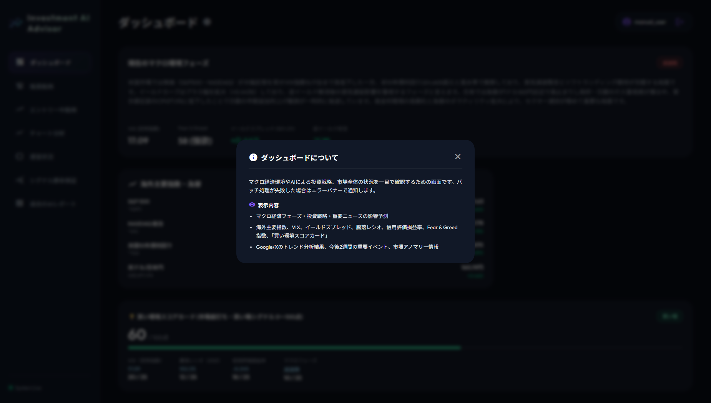

---

### 3.2 ダッシュボード画面の閲覧・操作

ログイン後のメイン画面です。現在のマクロ景気フェーズ、買い環境スコア（0〜100点）、AI推奨アセットアロケーション、ソーシャルトレンド、市場アノマリー情報を一目で把握できます。

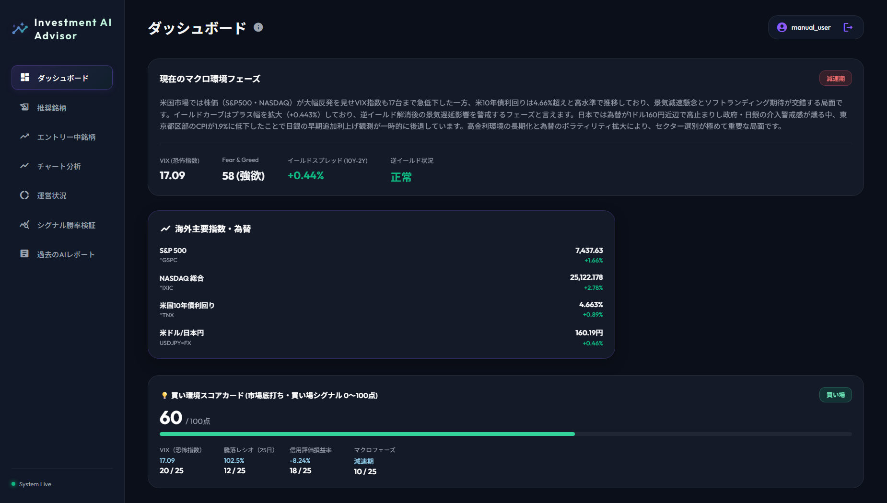

#### 【主な確認ポイント】

- **買い環境スコアカード**: VIX・騰落レシオ・信用損益率・マクロの統合スコア (0〜100点) と5段階ラベル（絶好の買い場〜買い見送り推奨）を確認。
- **マクロ景気フェーズ**: AIが判定した現在の「景気フェーズ」（回復期 / 拡大期 / 後退期 / 停滞期）を確認。
- **推奨アセットアロケーション**: 株式・現金・債券等の推奨配分バランス（例: 株式 60% / 現金 40%）を確認。
- **ソーシャルトレンド分析**: SNSやGoogle検索でのポジティブ/ネガティブ感情とAI解説を確認。

---

#### 💡 【表示元：ダッシュボード画面】市場アノマリー情報登録・編集モーダル (`AnomalyModal`)

ダッシュボード内の各アノマリーカード上の `編集` ボタン、またはカード右上の `＋ 追加` ボタンをクリックすると起動します。

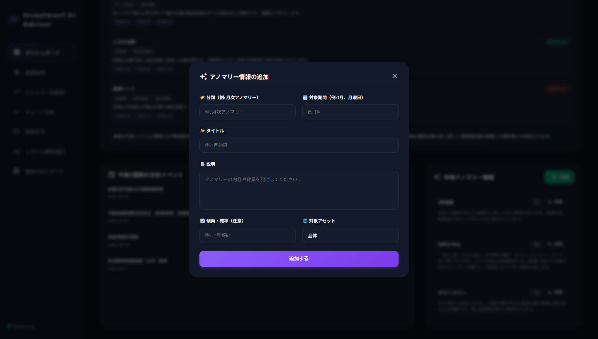

- **役割・使い方**:
  - 「Sell in May」や「節分天井・彼岸底」などの季節性・カレンダー要因について、対象期間、影響度、発生背景理由、注意すべき投資行動を入力・編集・削除できます。

---

### 3.3 推奨銘柄画面の確認 & 検討

スクリーニングバッチによって抽出されたAI評価スコアの高い注目銘柄を確認します。

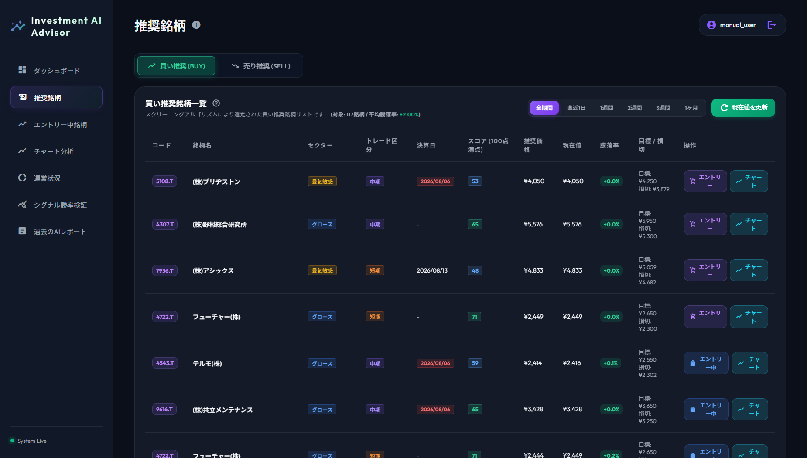

#### 【操作手順】

| 手順 | 操作内容 |
| :--- | :--- |
| 1 | サイドバーから **推奨銘柄** を選択します。 |
| 2 | 「買い推奨 (BUY)」と「売り推奨 (SELL)」のタブを切り替えて対象銘柄群を確認します。 |
| 3 | 表示期間（直近1日/1週間/1ヶ月/全期間）フィルターや「現在値を更新」ボタンで最新化します。 |
| 4 | 各銘柄行の `エントリー` または `📈 チャート` ボタンをクリックして各種モーダルを起動します。 |

---

#### 💡 【表示元：推奨銘柄画面】① AI評価スコア判定根拠モーダル (`RecommendationLogicModal`)

推奨銘柄画面のタイトル横にある `💡 ロジック` （ヘルプアイコン）ボタンをクリックすると起動します。

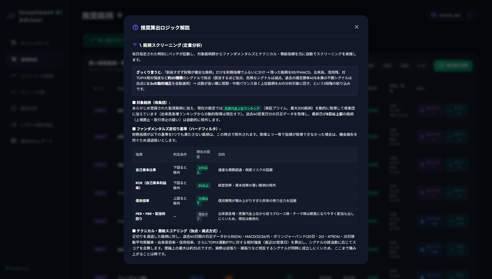

- **役割・使い方**:
  - AI総合スコア（0〜100点）の内訳（ファンダメンタルズ評価、テクニカル評価、感情分析スコア、マクロ環境適合度）、判定理由、ポジティブ・ネガティブ要素や除外ペナルティ基準を詳細確認できます。

---

#### 💡 【表示元：推奨銘柄画面】② ポジションサイジング機能付き意思決定メモモーダル (`MemoModal`)

推奨銘柄テーブルの各銘柄行にある `エントリー`（または `エントリー中`）ボタンをクリックすると起動します。

> 📷 スクリーンショット準備中（`modal_06_memo.png`）

- **役割・使い方**:
  - エントリー予定株価と損切り株価を入力すると、ユーザーの投資元本から **1%許容リスクルール** に基づいた最適購入株数（単元100株調整）を自動計算します。
  - 入力欄横に **`(推奨: X,XXX株)`** が動的に自動表示されます。
  - エントリー登録が完了すると、ボタン表記が `エントリー中` に自動更新されます。

---

#### 💡 【表示元：推奨銘柄画面】③ 銘柄詳細テクニカル分析チャートモーダル (`RecommendationChartModal`)

推奨銘柄テーブルの各銘柄行にある `📈 チャート` ボタンをクリックすると起動します。

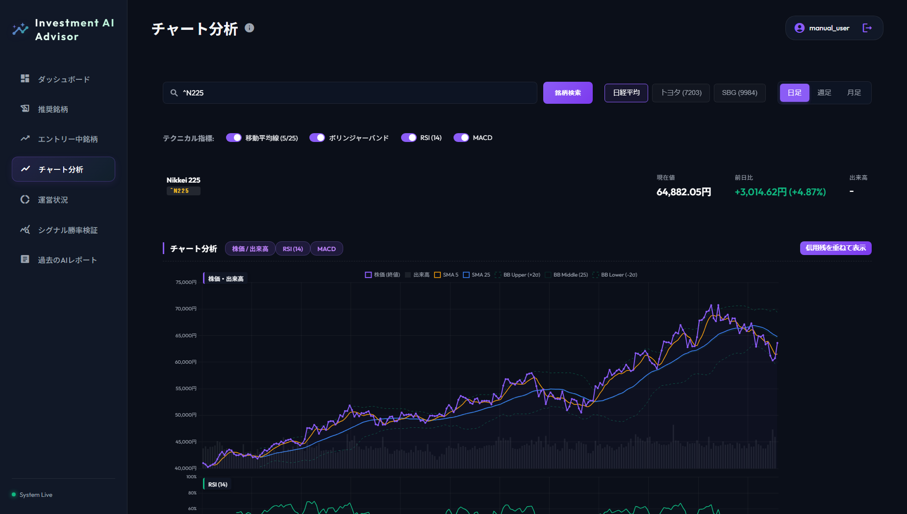

- **役割・使い方**:
  - 対象銘柄の株価推移グラフ（SMA5/SMA25/SMA75、ボリンジャーバンド、RSI等）および推奨価格、目標株価、損切り設定ラインをダイアログ内でインタラクティブに拡大参照できます。

---

### 3.4 エントリー中銘柄画面の管理 & 出口シグナル対応

保有中のポジション一覧と、トレーリングストップ・4大出口（売却）シグナルを確認します。


#### 【警告バッジと対応アクション】
- 🔴 **目標株価到達**: 利益確定売りの実行
- 🔴 **損切りライン到達**: 機械的な損切り実行
- 🟡 **RSI過熱 (買われすぎ/売られすぎ)**: 警戒・一部利確検討
- 🟡 **決算発表前警戒 (3日以内)**: イベントリスク回避のための決済検討

---

#### 💡 【表示元：エントリー中銘柄画面】① 手動銘柄追加モーダル (`AddCustomStockModal`)

画面右上にある **「＋ 銘柄を手動追加」** ボタンをクリックすると起動します。

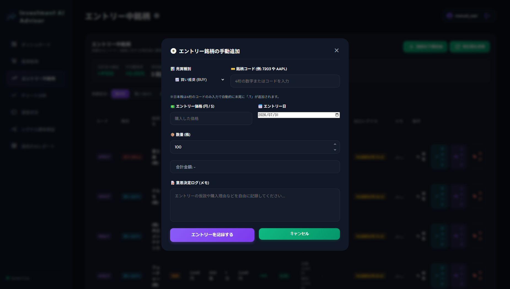

- **役割・使い方**:
  - スクリーニングリスト経由でない独自注目株や、他社口座で購入済みの銘柄について、銘柄コード・エントリー単価・約定日・数量・目標株価・損切り株価・意思決定メモを入力して手動で追加登録します。

---

#### 💡 【表示元：エントリー中銘柄画面】② 売却決済モーダル (`SellModal`)

各保有ポジションカード内の **「売却 / 決済」** ボタンをクリックすると起動します。

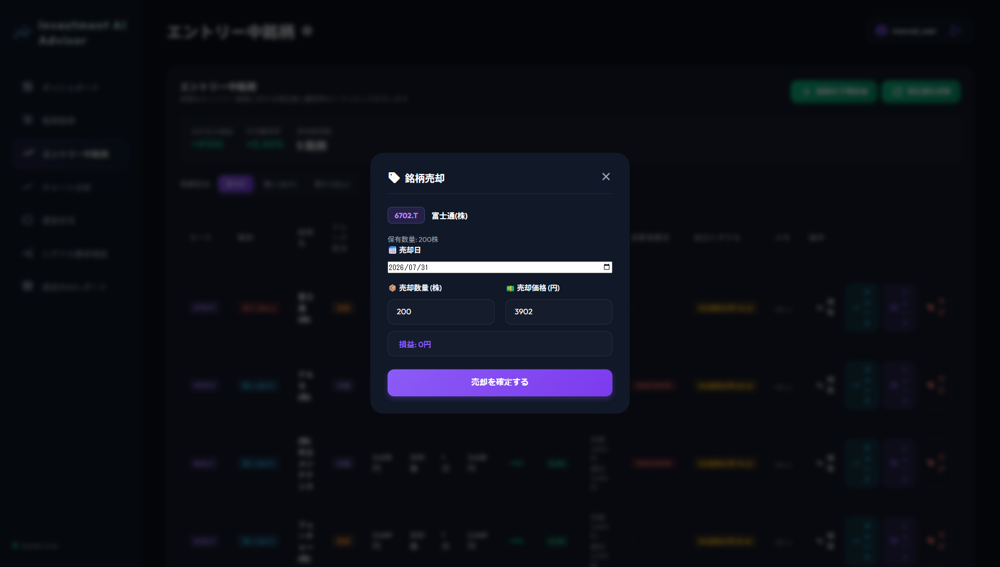

- **役割・使い方**:
  - 実際の売却単価、売却日、売却数量（全売却/一部売却）、売却理由（目標到達/損切り/決算回避等）、エグジットメモを入力して決済を実行します。確定損益は「運営状況」へ即座に反映されます。

---

### 3.5 テクニカルチャート分析画面

メインの株価チャート・出来高グラフに加え、下部に **RSI (14日相対力指数)** および **MACD (移動平均収束拡散)** のサブチャートをビジュアル表示します。

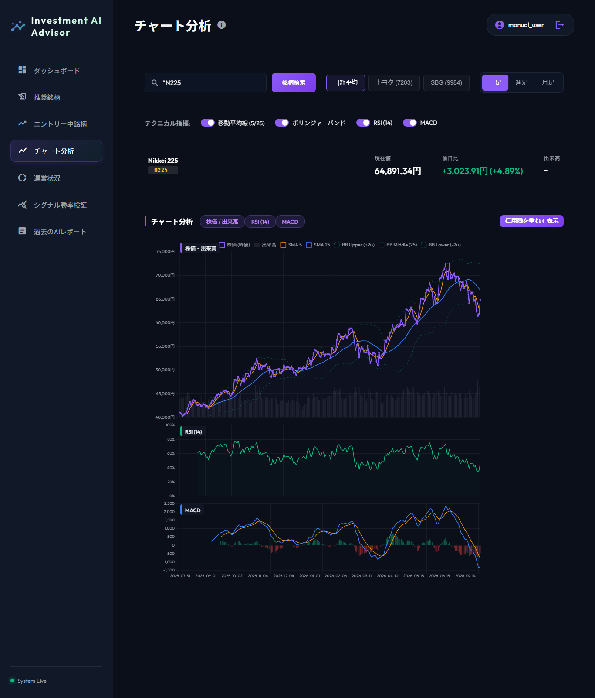

#### 【操作手順 & 主な指標】

| 手順 / 指標 | 操作・解説内容 |
| :--- | :--- |
| **1. 銘柄検索** | 画面上部の検索欄に銘柄コード（例: `7203`）を入力し、Enterキーを押すか検索ボタンをクリックします。 |
| **2. メインチャート** | 終値ベースの株価推移、移動平均線 (SMA5/SMA25)、ボリンジャーバンド (±2σ)、および目標株価/損切り設定株価の水平線を確認します。 |
| **3. RSI サブチャート** | 14日RSIグラフを表示。買われすぎライン (70%以上) や売られすぎライン (30%以下) を一目で把握できます。 |
| **4. MACD サブチャート** | MACD線とシグナル線のクロスオーバー（ゴールデンクロス / デッドクロス）およびヒストグラムを確認します。 |
| **5. 表示制御・ガイド** | 上部のスイッチで移動平均線・ボリンジャーバンド・RSI・MACDの表示/非表示を個別に切り替え可能です。マウスホバーで全チャート共通の垂直破線ガイド（クロスヘア）が表示されます。 |

---

### 3.6 運営状況画面の登録 & 投資日記の記録

取引実績と投資理由・反省点を記録・分析し、トレードルールの改善に役立てます。

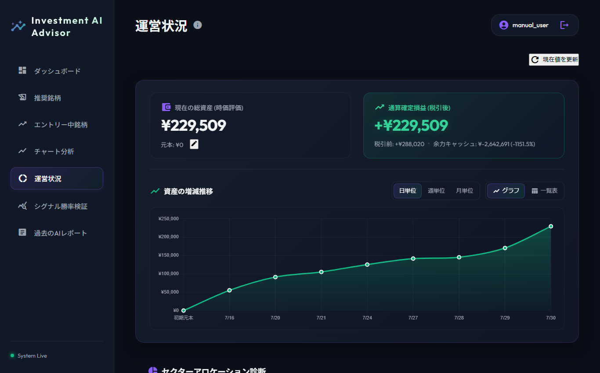

---

#### 💡 【表示元：運営状況画面】① 意思決定ログ（メモ）編集モーダル (`MemoModal`)

取引カードまたは行の **「日記編集」**（`📝 メモ`）アイコンをクリックすると起動します。

> 📷 スクリーンショット準備中（`modal_06_memo.png`）

- **役割・使い方**:
  - 買い理由（エントリー根拠）、売り理由（エグジット根拠）、振り返りノート（反省点・学び）を閲覧・追記・修正します。

---

#### 💡 【表示元：運営状況画面】② 取引履歴編集モーダル (`TradeEditModal`)

取引一覧テーブルの **「編集」**（`✏️ 編集`）アイコンをクリックすると起動します。

> 📷 スクリーンショット準備中（`modal_09_trade_edit.png`）

- **役割・使い方**:
  - 既に確定済みの過去トレードデータについて、誤って入力された買単価・売単価・約定数量・損益額を手修正します。

---

### 3.7 シグナル勝率検証画面

スクリーニングシグナルやAI評価スコアごとの過去の勝率・平均損益・プロフィットファクター（PF）をデータに基づいて詳細検証できます。ページ全体の全カードおよび機能別カードに分けて確認が可能です。

#### 📊 画面全体（ノーカット全表示）

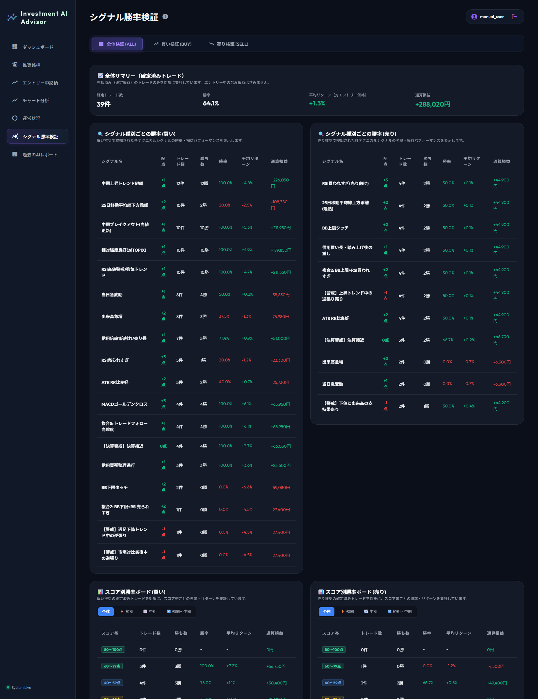

---

#### 💡 機能別カード詳細

##### ① 全体サマリー & シグナル別勝率（買い・売り）

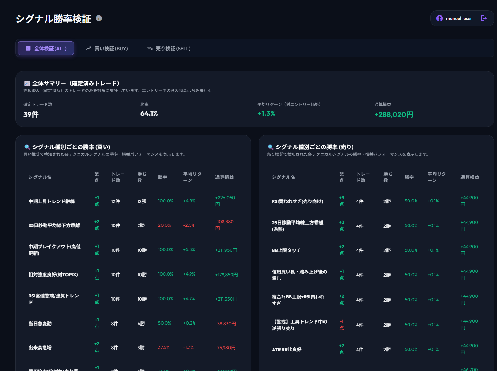

- **全体サマリー**: 確定トレード数、勝率(%)、平均リターン、通算損益を一目で確認。
- **シグナル別勝率（買い・売り）**: ゴールデンクロス・RSI逆張り・BB突破等の各テクニカルシグナルごとの過去勝率や獲得損益を表示。

##### ② AIスコア別勝率ボード（買い・売り）

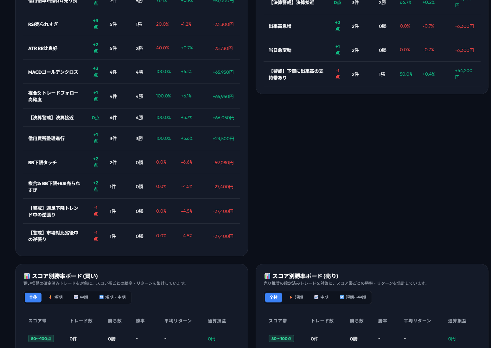

- **AIスコア帯別期待値**: AI総合スコア（80〜100点、60〜79点、40〜59点等）に応じた過去勝率・平均リターンを期間別（短期/中期/短期〜中期）に検証できます。

---

### 3.8 過去のAIレポート閲覧画面

バックエンドの自動ワークフローバッチ（8:30 / 12:00 / 15:00）によって過去に配信・保存された日次・週次のAI分析レポートをアーカイブ閲覧できます。

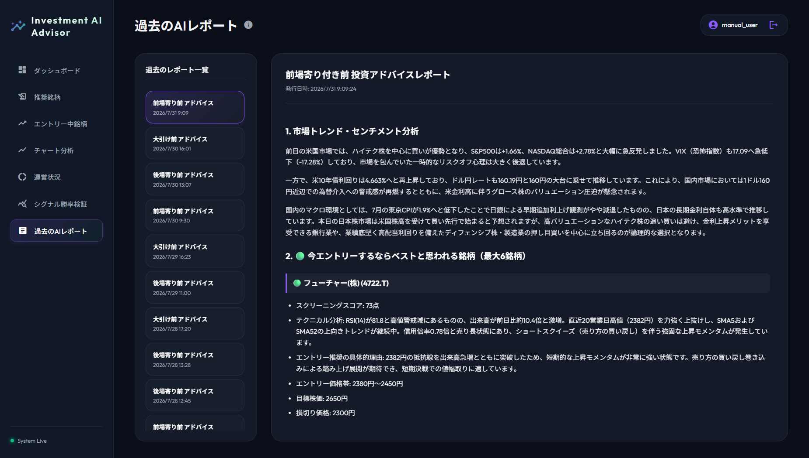

#### 【主な確認ポイント】

- **日次レポートアーカイブ一覧**: 日付順に過去のレポートが一覧表示されます。
- **AIレポート本文閲覧**: レポートを選択すると、当時の景気判断・注目セクター・スクリーニング銘柄の選定理由（HTML/Markdown形式）を閲覧できます。

---

## 4. ワークフローバッチの実行・運用手順 (管理者向け)

### 4.1 手動テスト実行 (メール送信なし)

```bash
# マクロ分析および推奨銘柄抽出のテスト実行
npm run test-workflow -- --mode full
```

### 4.2 本番実行 (データベース保存 & メール送信)

```bash
# 日次マクロ分析バッチ実行
npm run workflow:macro

# 推奨銘柄スクリーニング & AI分析バッチ実行
npm run workflow:recommend
```

### 4.3 定期自動化 (Cron 設定例: 8:30 / 12:00 / 15:00)

```cron
# 平日(月〜金) 08:30 前場寄せ前スクリーニング & 朝のレポート送信
30 8 * * 1-5 cd /path/to/stock-trading-support-tool && /usr/bin/npm run workflow:recommend >> /path/to/logs/cron_morning.log 2>&1

# 平日(月〜金) 12:00 後場寄せ前スクリーニング & 昼のレポート送信
0 12 * * 1-5 cd /path/to/stock-trading-support-tool && /usr/bin/npm run workflow:recommend >> /path/to/logs/cron_noon.log 2>&1

# 平日(月〜金) 15:00 大引け後総合スクリーニング & 夕方のレポート送信
0 15 * * 1-5 cd /path/to/stock-trading-support-tool && /usr/bin/npm run workflow:recommend >> /path/to/logs/cron_evening.log 2>&1
```

---

## 5. FAQ・トラブルシューティング

### Q1. ログイン時に「認証に失敗しました」と表示される

- ユーザー名およびパスワードが正しく入力されているか確認してください。
- アカウント未作成の場合はシステム管理者に問い合わせてください。
