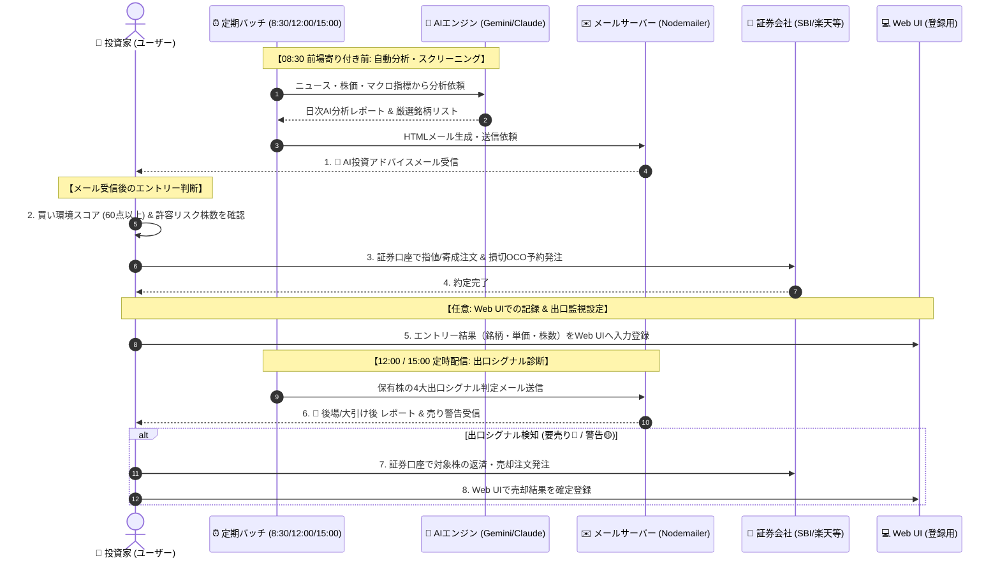
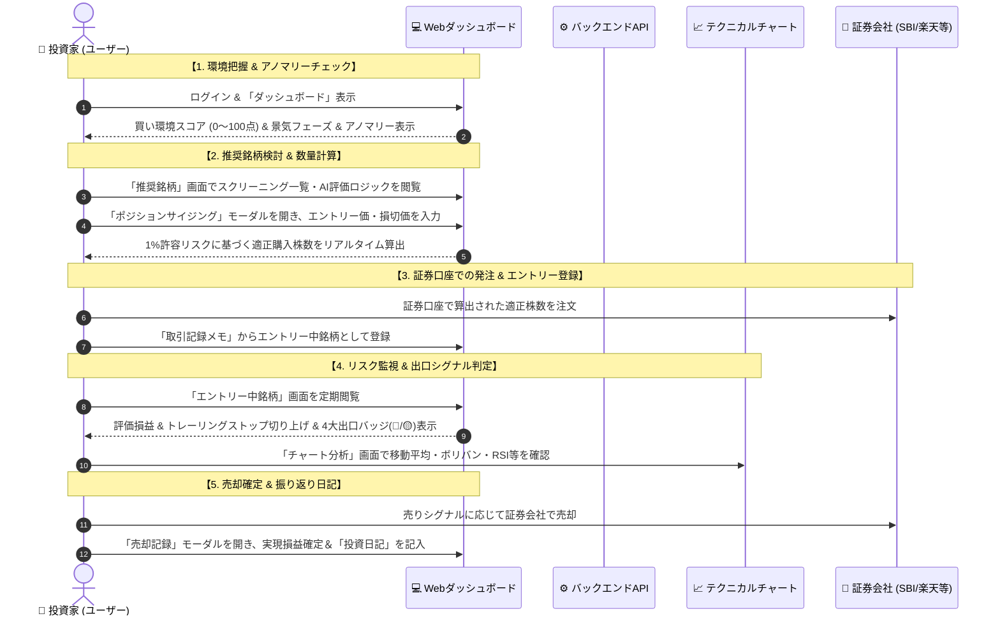
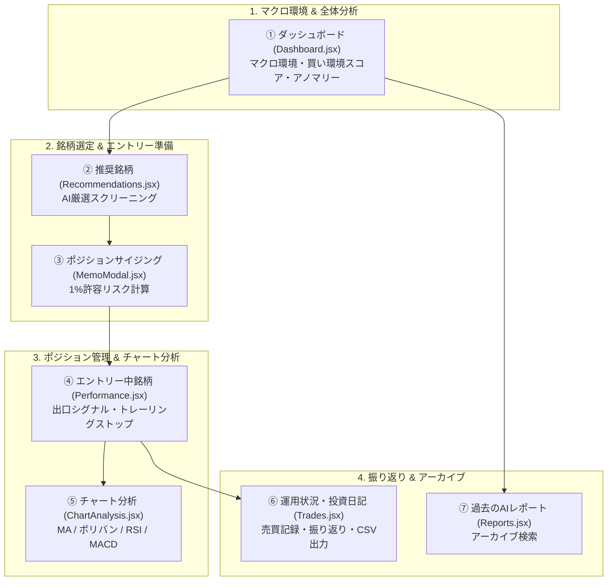
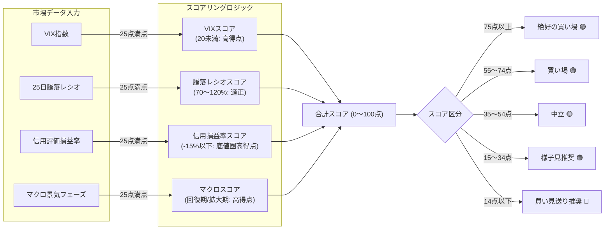
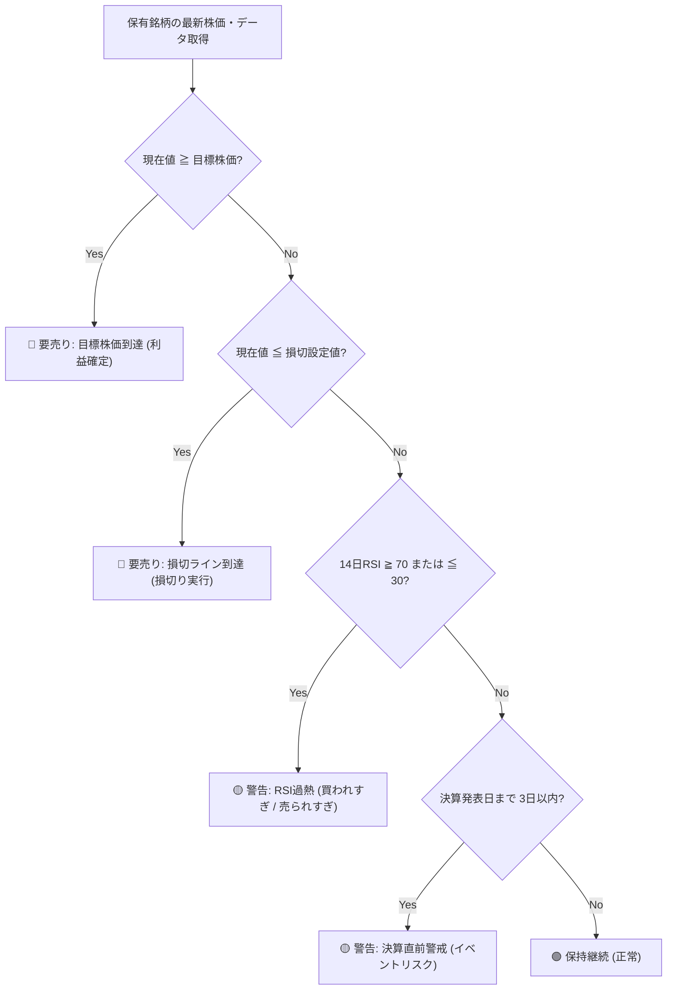
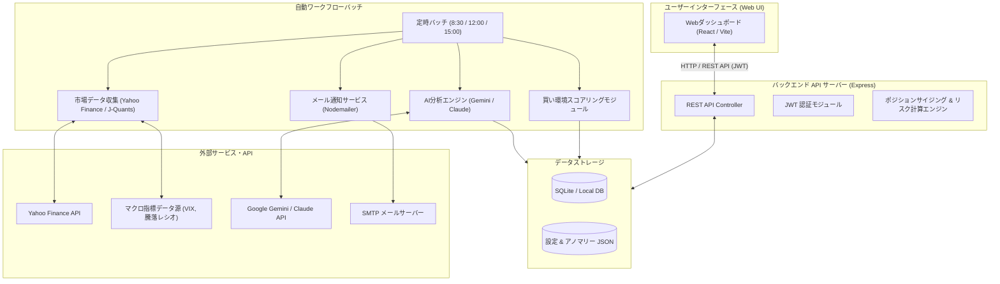
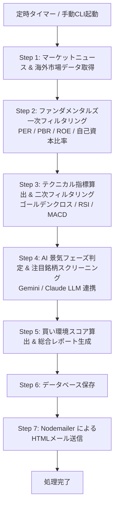
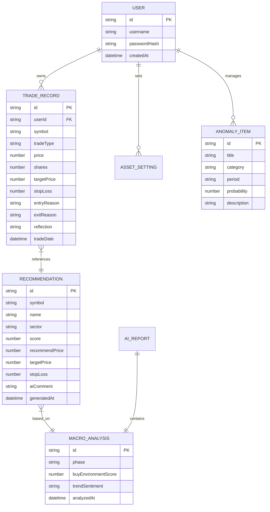

# システム概要仕様書 (System Overview Specification)

> **ドキュメントID**: SPEC-EXT-000  
> **対象システム**: 個人投資家向け投資判断支援ツール (Investment Decision Support Tool)  
> **最終更新日**: 2026-07-31

---

> [!NOTE]
> **💡 30秒でわかる本ツールの全体像**
>
> - **目的**: 感情や直感を排除し、データとAI主導で勝率の高い日本株投資を行う支援ツール
> - **核となる機能**:
>   1. 毎日 8:30 / 12:00 / 15:00 にAIが自動スクリーニング & レポート配信
>   2. 買える市場環境か一目でわかる「**買い環境スコア (0〜100点)**」
>   3. 資産の1%損失に抑える「**適正購入株数の自動ポジションサイジング**」
>   4. 売り時を逃さない「**4大出口シグナル自動警告**（目標到達/損切/RSI過熱/決算直前）」

---

## 1. システム概要と目的

### 1.1 解決する課題とビフォーアフター

個人投資家が陥りがちな「感情的な売買」をシステムとAIが自動排除します。

| 比較項目 | 従来の投資スタイルの課題 ❌ | 本ツール導入後のアプローチ ⭕ |
| :--- | :--- | :--- |
| **環境判断** | ニュースや雰囲気で「なんとなく買い」 | **買い環境スコア (0〜100点)** で客観評価 |
| **銘柄選択** | SNSの話題株や思いつきで選定 | **AIスクリーニング & ファンダメンタルズ厳選** |
| **購入株数** | 資金限界まで勘で購入 (リスク過大) | **1%許容リスク法則**で安全な購入株数を自動計算 |
| **損切り・利確** | 損切りできずに塩漬け / 焦って利確 | **トレーリングストップ & 4大出口シグナル**で機械的売り |
| **振り返り** | 勝ち負けの原因が分からず再現性なし | **投資日記 & AIレポートアーカイブ**で継続改善 |

### 1.2 システムの目的と概要

本システムは、個人投資家が感情や直感に惑わされず、**「データとAIに基づいた客観的かつ体系的な投資判断」** を行えるよう支援する投資管理・意思決定プラットフォームです。

---

## 2. ツール活用シナリオ & 取引運用ライフサイクル

本ツールは、ユーザーのトレードスタイルや利用環境に応じて**「メール通知駆動型」**と**「Web UI直接操作型」**の2つの独立した取引運用ワークフローを提供します。

---

### 2.1 【ワークフロー A】メール通知駆動型 運用ワークフロー (Batch & Email Workflow)

日中忙しい投資家や、メールで迅速にトレード判断を行いたいユーザー向けのワークフローです。  
定期バッチ（08:30 / 12:00 / 15:00）により配信される「AI投資アドバイスメール」を起点として、購入から売り時の判定までをメールメインでスムーズに実行します。

#### メール通知駆動シーケンス図

#### ワークフロー A のステップ別ガイド

1. **Step 1: 朝のメール受信 (08:30)**
   - 毎朝届く「寄り付き前アドバイスメール」で**買い環境スコア**（60点以上か）と**AI推奨銘柄**を確認。
2. **Step 2: 許容リスク株数での発注**
   - メール本文に算出されている「許容リスク1%に応じた推奨購入株数」を確認し、自身の証券口座へ指値・成行注文を発注。
3. **Step 3: アプリへ約定記録入力（任意）**
   - 約定後、Web UIにログインして約定単価と株数を入力し、自動リスク監視（トレーリングストップ）を開始。
4. **Step 4: 後場・大引けメールでの出口シグナル確認 (12:00 / 15:00)**
   - 届いたメールで「4大出口シグナル（目標到達・損切・RSI過熱・決算直前）」の警告がないか確認。
5. **Step 5: 証券会社での手仕舞い発注**
   - 売り警告が発生した場合は、証券口座で売却発注を行い、必要に応じてWeb UIに売却記録と振り返りを入力。

詳しくはこちら: **[メール受信・取引注文運用手順書 (MANUAL-EXT-002)](./02_email_order_manual.md)**

---

### 2.2 【ワークフロー B】Web UI直接操作型 運用ワークフロー (Interactive Web UI Workflow)

PCやタブレットの大きな画面でグラフや詳細データを確認し、ダイレクトに銘柄選定・ポジショニング・損益分析を行いたいユーザー向けのワークフローです。

#### Web UI直接操作シーケンス図

#### ワークフロー B のステップ別ガイド

1. **Step 1: ダッシュボードで環境分析**
   - Web UIにログインし、「買い環境スコア」「マクロ景気フェーズ」「市場アノマリー」を確認し、本日のエントリー可否を判断。
2. **Step 2: 推奨銘柄のAI解釈 & チャート分析**
   - 「推奨銘柄」画面で銘柄を選び、「AI評価判定根拠モーダル」や「チャート分析」画面でテクニカル・ファンダメンタルズ根拠を分析。
3. **Step 3: ポジションサイジング機能で適正株数算出**
   - 「ポジションサイジング（`MemoModal`）」でエントリー想定株価と損切りラインを入力し、総資産の1%リスクに収まる「推奨購入株数」を即時計算。
4. **Step 4: エントリー登録とリアルタイム監視**
   - 約定後「エントリー中銘柄」に登録。最高値更新に合わせたトレーリングストップや、4大出口シグナルを画面上で視覚的に監視。
5. **Step 5: 売却記録 & 投資日記でのノウハウ蓄積**
   - 手仕舞い後、「運営状況・投資日記」画面で取引履歴を確定し、勝因・敗因の反省メモを残して次回トレードへ活かす。

詳しくはこちら: **[Web UI画面操作手順書 (MANUAL-EXT-003)](./03_web_ui_manual.md)**

---

## 3. 画面・機能ブロック概要

Webダッシュボードは、投資の各段階（状況把握 → 銘柄選択 → 数量決定 → リスク管理 → 振返り）に対応する6つの画面と1つのモーダル機能で構成されています。

### 画面・機能一覧と概要

| 画面・機能 | 主要コンポーネント | 役割と主な機能 |
| :--- | :--- | :--- |
| **① ダッシュボード** | `Dashboard.jsx` | 現在の景気フェーズ、推奨アロケーション、**買い環境スコア（0〜100点）**、ソーシャルトレンド、市場アノマリー情報の可視化 |
| **② 推奨銘柄** | `Recommendations.jsx` | スクリーニングされた注目銘柄の一覧、スコア、目標株価、損切ライン、AIによる選定理由の閲覧 |
| **③ ポジションサイジング** | `MemoModal.jsx` | 総資産の1%を最大許容損失とする最適購入株数・必要投資額・ポートフォリオ占有率の自動計算モーダル `推奨株数 = (総資産 × 1%) ÷ (エントリー株価 - 損切株価)` |
| **④ エントリー中銘柄** | `Performance.jsx` | 保有ポジションの評価損益、トレーリングストップ切り上げ表示、**4大出口シグナル（要売り/警告）** の自動判定 |
| **⑤ チャート分析** | `ChartAnalysis.jsx` | 移動平均線(5日/25日)、ボリンジャーバンド(±2σ)、RSI(14日)、MACDおよびエントリー/損切水平線の表示 |
| **⑥ 運用状況・投資日記** | `Trades.jsx` | 約定履歴の記録、売買理由・振り返りメモの記述、実現損益計算、CSVエクスポート機能 |
| **⑦ 過去のAIレポート** | `Reports.jsx` | 過去にバッチで配信された日次AI分析レポートのアーカイブ参照 |

---

## 4. 買い環境スコア & 出口シグナル判定ロジック

本システムを象徴する2つの主要ロジックの判定フローです。

### 4.1 買い環境スコア算出フロー (100点満点)

4つの主要指標（VIX、25日騰落レシオ、信用評価損益率、マクロ景気フェーズ）を配点・加算し、総合評価を算出します。

### 4.3 銘柄スクリーニングスコア（BUY / SELL加減点 & 動的学習補正）

個別銘柄の判定では、ファンダメンタルズ足切り（自己資本比率20%以上、ROE 8%以上、信用倍率10倍以下）を通過した銘柄に対し、RSI・MACD・ボリンジャーバンド・出来高・信用倍率・TOPIX相対強度などのテクニカル・需給シグナルを加減点採点（生スコア算出）します。

- **BUYモード（買い候補）**: 強気反転（RSI売られすぎ +3点, MACDゴールデンクロス +3点 等）や順張り上昇を大きく加点し、下降トレンド逆張り（-1点〜-3点）を減点ペナルティ。
- **SELLモード（売り/空売り候補）**: 過熱・天井打ち（RSI買われすぎ +3点, MACDデスクロス +3点 等）や下降継続を加点し、空売り後の買い戻しリスク（RSI売られすぎ -3点 等）を減点ペナルティ。
- **100点満点換算 (`normScore`)**: 判定区分に応じた理論最大点に対する割合を100点満点に正規化（80点以上：バイオレット表示 🟣, 60〜79点：エメラルド表示 🟢）。
- **動的配点調整 (Dynamic Learning)**: 過去の推奨ウォークフォワード追跡データに基づき、確定勝率40%未満の不調シグナルには `0.5x` の動的減額補正を自動適用して精度を継続向上。

### 4.2 エントリー中銘柄の4大出口シグナル判定

保有ポジションに対して毎日自動判定を行い、手仕舞いが必要な場合にバッジ表示します。

---

## 5. システムアーキテクチャ

本システムは、ReactベースのWebフロントエンド、Express APIサーバー、バックエンドバッチ処理パイプライン、SQLite/JSONデータベース、および外部AI（Google Gemini / Anthropic Claude）から構成されています。

---

## 6. 自動分析・通知ワークフローバッチ

システムは日本時間の毎日 **8:30 (前場寄せ前)**、**12:00 (後場寄せ前)**、**15:00 (大引け後)** にバックエンドバッチを定期実行します。

---

## 7. データ構造 & エンティティ関係図 (ER図)

本システムで管理される主要なデータの関連性です。

---

## 8. 詳細仕様書・マニュアルへの案内

各画面の入出力パラメータの詳細や、具体的なセットアップ手順については以下のドキュメントを参照してください。

- **[外部機能仕様書 (詳細版)](./01_functional_spec.md)**
  - APIエンドポイント仕様、画面コンポーネント詳細、例外処理・非機能要件
- **[メール受信・取引注文運用手順書](./02_email_order_manual.md)**
- **[Web UI画面操作手順書](./03_web_ui_manual.md)**
  - Web UIのセットアップ・ログイン手順、買い環境スコアの見方、取引メモ・投資日記の使い方、トラブルシューティング
- **[GitHub リポジトリトップ README](https://github.com/baann1000p-debug/stock-trading-support-tool-design-external/blob/main/README.md)**
  - インストール、動作環境、環境変数設定など

---
