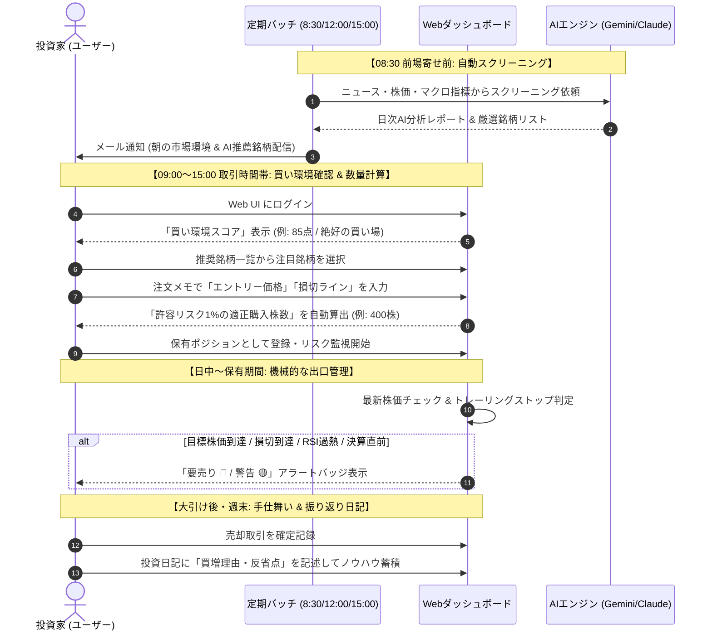
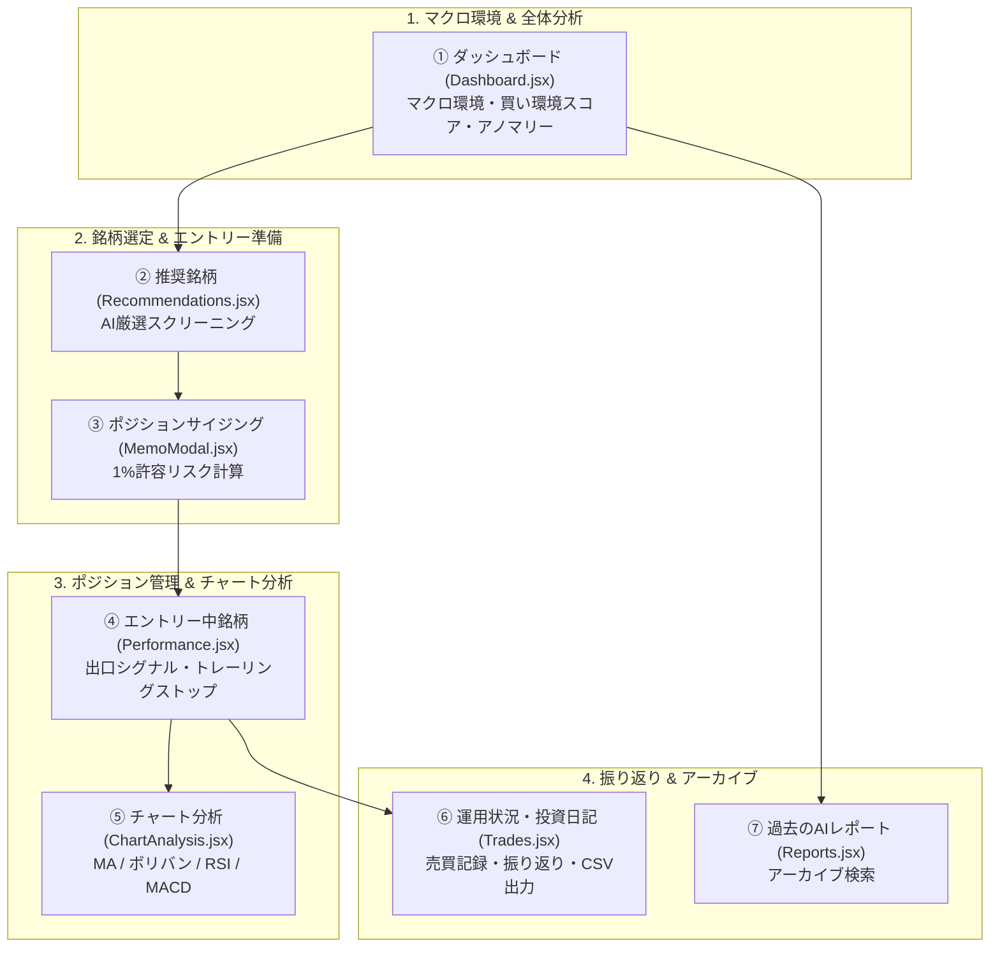
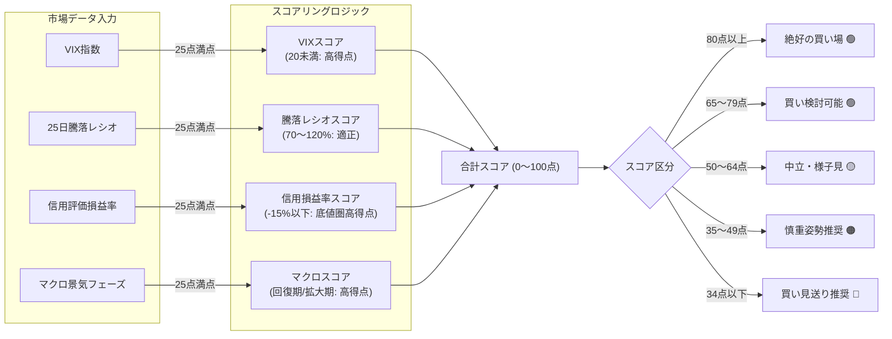
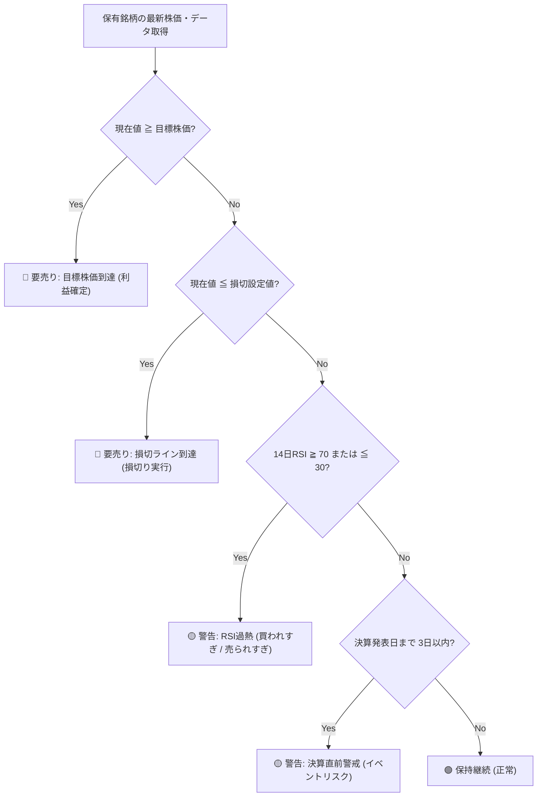
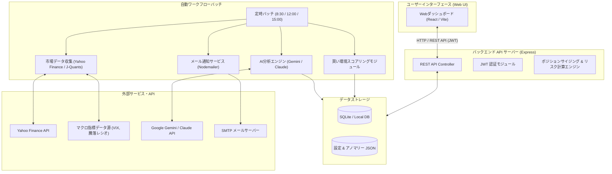
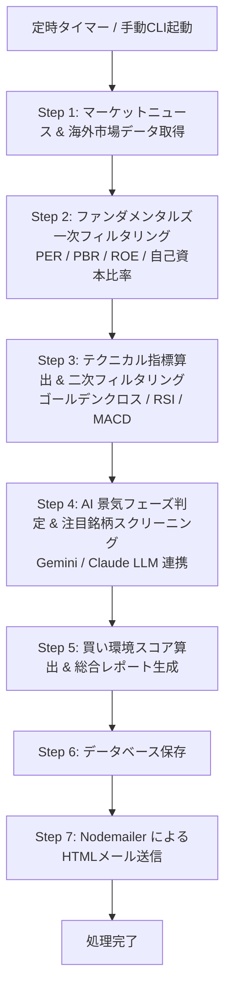
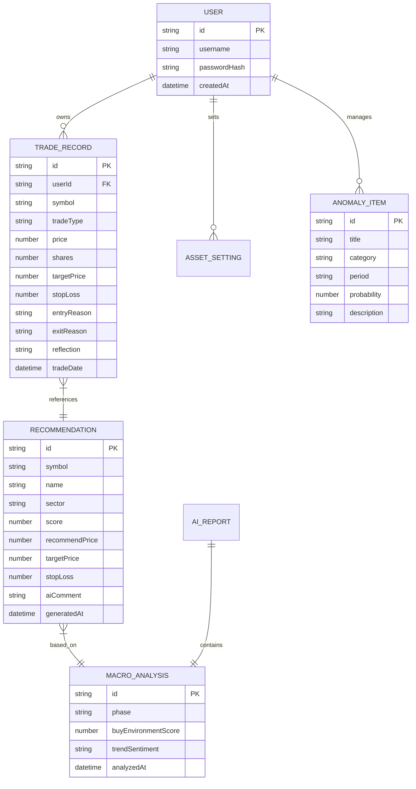

# システム概要仕様書 (System Overview Specification)

> **ドキュメントID**: SPEC-EXT-000  
> **対象システム**: 個人投資家向け投資判断支援ツール (Investment Decision Support Tool)  
> **最終更新日**: 2026-07-31

---

> [!NOTE]
> **💡 30秒でわかる本ツールの全体像**
>
> - **目的**: 感情や直感を排除し、データとAI主導で勝率の高い日本株投資を行う支援ツール
> - **核となる機能**:
>   1. 毎日 8:30 / 12:00 / 15:00 にAIが自動スクリーニング & レポート配信
>   2. 買える市場環境か一目でわかる「**買い環境スコア (0〜100点)**」
>   3. 資産の1%損失に抑える「**適正購入株数の自動ポジションサイジング**」
>   4. 売り時を逃さない「**4大出口シグナル自動警告**（目標到達/損切/RSI過熱/決算直前）」

---

## 1. システム概要と目的

### 1.1 解決する課題とビフォーアフター

個人投資家が陥りがちな「感情的な売買」をシステムとAIが自動排除します。

| 比較項目 | 従来の投資スタイルの課題 ❌ | 本ツール導入後のアプローチ ⭕ |
| :--- | :--- | :--- |
| **環境判断** | ニュースや雰囲気で「なんとなく買い」 | **買い環境スコア (0〜100点)** で客観評価 |
| **銘柄選択** | SNSの話題株や思いつきで選定 | **AIスクリーニング & ファンダメンタルズ厳選** |
| **購入株数** | 資金限界まで勘で購入 (リスク過大) | **1%許容リスク法則**で安全な購入株数を自動計算 |
| **損切り・利確** | 損切りできずに塩漬け / 焦って利確 | **トレーリングストップ & 4大出口シグナル**で機械的売り |
| **振り返り** | 勝ち負けの原因が分からず再現性なし | **投資日記 & AIレポートアーカイブ**で継続改善 |

### 1.2 システムの目的と概要

本システムは、個人投資家が感情や直感に惑わされず、**「データとAIに基づいた客観的かつ体系的な投資判断」** を行えるよう支援する投資管理・意思決定プラットフォームです。

---

## 2. ツール活用シナリオ & 取引運用ライフサイクル

本アプリを日常の投資活動で「どのように使えるのか」「どのように使用するのか」の一連の流れです。

### 2.1 ユーザーの一日の運用タイムライン

### 2.2 ステップ別具体的な使い方ガイド

1. **Step 1: 朝のメール・分析レポート確認 (08:30)**
   - 毎朝届くHTMLメールまたはWeb UIで「マクロ景気フェーズ」と「AI注目銘柄」をチェック。
2. **Step 2: 買い環境スコアの確認**
   - ダッシュボードで「買える日か（80点以上）」を確認。スコアが低い日（34点以下など）は無理にエントリーせず静観。
3. **Step 3: スクリーニング銘柄のAI解釈確認**
   - 推奨銘柄一覧から、AIの推薦コメント（ファンダメンタルズ＋テクニカルの根拠）を確認。
4. **Step 4: 1%許容リスクに基づく購入株数の算出**
   - 購入予定株価と損切り株価を入力するだけで、資産全体に対する損失を1%以内に抑える「適正購入株数」が自動計算されるため、その株数で証券会社に発注。
5. **Step 5: 出口シグナル（売り時）の監視**
   - エントリー中銘柄画面を開くだけで、最高値更新に伴う損切りラインの繰り上げ（トレーリングストップ）や、目標到達・決算直前などの「売りシグナル」を自動検知。
6. **Step 6: 手仕舞いと投資日記の記入**
   - 取引終了後、エントリー理由やエグジットの反省点を「投資日記」に記録し、トレードの勝率・再現性を向上。

---

## 3. 画面・機能ブロック概要

Webダッシュボードは、投資の各段階（状況把握 → 銘柄選択 → 数量決定 → リスク管理 → 振返り）に対応する6つの画面と1つのモーダル機能で構成されています。

### 画面・機能一覧と概要

| 画面・機能 | 主要コンポーネント | 役割と主な機能 |
| :--- | :--- | :--- |
| **① ダッシュボード** | `Dashboard.jsx` | 現在の景気フェーズ、推奨アロケーション、**買い環境スコア（0〜100点）**、ソーシャルトレンド、市場アノマリー情報の可視化 |
| **② 推奨銘柄** | `Recommendations.jsx` | スクリーニングされた注目銘柄の一覧、スコア、目標株価、損切ライン、AIによる選定理由の閲覧 |
| **③ ポジションサイジング** | `MemoModal.jsx` | 総資産の1%を最大許容損失とする最適購入株数・必要投資額・ポートフォリオ占有率の自動計算モーダル `推奨株数 = (総資産 × 1%) ÷ (エントリー株価 - 損切株価)` |
| **④ エントリー中銘柄** | `Performance.jsx` | 保有ポジションの評価損益、トレーリングストップ切り上げ表示、**4大出口シグナル（要売り/警告）** の自動判定 |
| **⑤ チャート分析** | `ChartAnalysis.jsx` | 移動平均線(5日/25日)、ボリンジャーバンド(±2σ)、RSI(14日)、MACDおよびエントリー/損切水平線の表示 |
| **⑥ 運用状況・投資日記** | `Trades.jsx` | 約定履歴の記録、売買理由・振り返りメモの記述、実現損益計算、CSVエクスポート機能 |
| **⑦ 過去のAIレポート** | `Reports.jsx` | 過去にバッチで配信された日次AI分析レポートのアーカイブ参照 |

---

## 4. 買い環境スコア & 出口シグナル判定ロジック

本システムを象徴する2つの主要ロジックの判定フローです。

### 4.1 買い環境スコア算出フロー (100点満点)

4つの主要指標（VIX、25日騰落レシオ、信用評価損益率、マクロ景気フェーズ）を配点・加算し、総合評価を算出します。

### 4.2 エントリー中銘柄の4大出口シグナル判定

保有ポジションに対して毎日自動判定を行い、手仕舞いが必要な場合にバッジ表示します。

---

## 5. システムアーキテクチャ

本システムは、ReactベースのWebフロントエンド、Express APIサーバー、バックエンドバッチ処理パイプライン、SQLite/JSONデータベース、および外部AI（Google Gemini / Anthropic Claude）から構成されています。

---

## 6. 自動分析・通知ワークフローバッチ

システムは日本時間の毎日 **8:30 (前場寄せ前)**、**12:00 (後場寄せ前)**、**15:00 (大引け後)** にバックエンドバッチを定期実行します。

---

## 7. データ構造 & エンティティ関係図 (ER図)

本システムで管理される主要なデータの関連性です。

---

## 8. 詳細仕様書・マニュアルへの案内

各画面の入出力パラメータの詳細や、具体的なセットアップ手順については以下のドキュメントを参照してください。

- **[外部機能仕様書 (詳細版)](./01_functional_spec.md)**
  - APIエンドポイント仕様、画面コンポーネント詳細、例外処理・非機能要件
- **[メール受信・取引注文運用手順書](./02_email_order_manual.md)**
- **[Web UI画面操作手順書](./03_web_ui_manual.md)**
  - Web UIのセットアップ・ログイン手順、買い環境スコアの見方、取引メモ・投資日記の使い方、トラブルシューティング
- **[GitHub リポジトリトップ README](https://github.com/baann1000p-debug/stock-trading-support-tool-design-external#readme)**
  - インストール、動作環境、環境変数設定など

---
