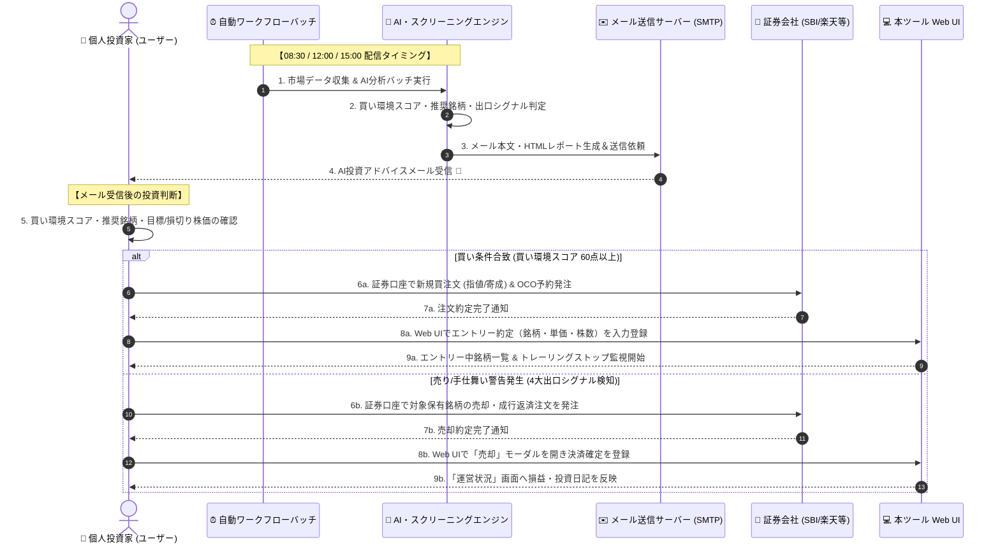
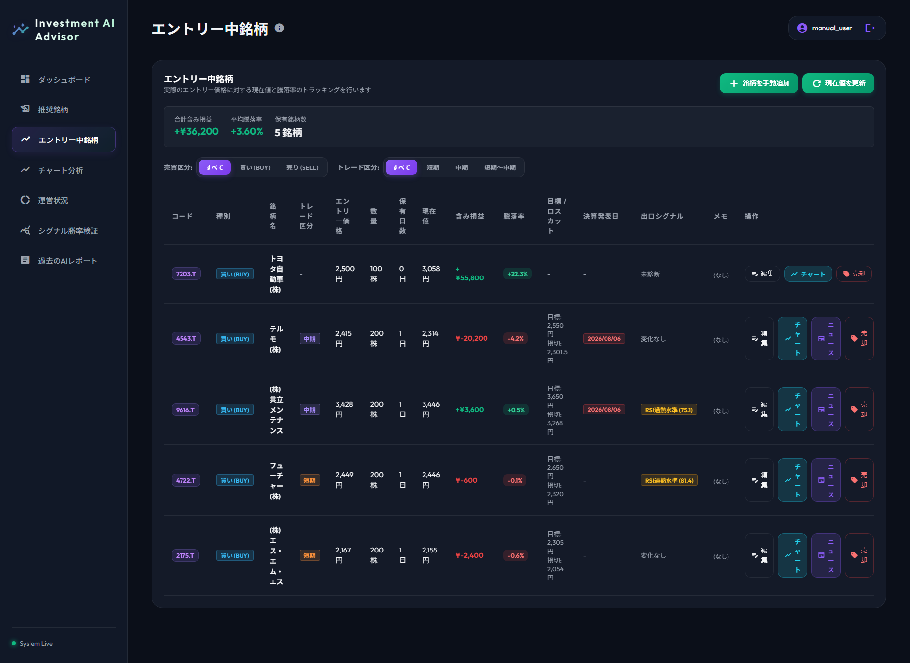

# メール受信・取引注文運用手順書 (Email Notification & Order Execution Manual)

> **ドキュメントID**: MANUAL-EXT-002  
> **対象システム**: 個人投資家向け投資判断支援ツール (Investment Decision Support Tool)  
> **最終更新日**: 2026-07-31

---

## 1. 概要と目的

本書は、**【ワークフロー A】メール通知駆動型 運用ワークフロー**の専用運用手順書です。  
本システムが自動配信する**「AI投資アドバイスメール」を受信してから、実際に個人の証券口座（SBI証券、楽天証券、松井証券等）で買い・売り注文を発注し、アプリへ結果を記録するまでの一連の運用手順**を解説します。

> 💡 **ワークフローの使い分け**
>
> - **ワークフロー A (本書)**: 毎日の自動配信メールを中心に、手早く購入・売却判断と発注を行いたい投資家向け。
> - **ワークフロー B**: 画面上でチャート分析やアノマリー閲覧、詳細な売買記録を行いたい方は **[Web UI画面操作手順書 (MANUAL-EXT-003)](./03_web_ui_manual.md)** を参照してください。

---

## 2. メール配信スケジュールと通知内容

本システムでは、日本の株式市場の取引時間に合わせて1日3回の自動バッチ処理が実行され、通知メールが送信されます。

```
[08:30] 前場寄り付き前アドバイスメール ───► 【買いエントリー判断】当日の市況・買い推奨銘柄
[12:00] 後場寄り付き前アドバイスメール ───► 【後場トレード＆手仕舞い】前場動向・急変シグナル
[15:00] 大引け後・日次レポートメール   ───► 【日次振り返り＆出口判断】4大出口シグナル・確定結果
```

| 配信時刻 | メール件名例 | 受信後のアクション |
| :--- | :--- | :--- |
| **08:30** | `【前場寄り付き前】AI投資アドバイス＆買い推奨銘柄` | マクロ景気・買い環境スコアを確認し、寄り付き前の買い指値/成行注文を発注 |
| **12:00** | `【後場寄り付き前】後場市況アドバイス＆シグナル更新` | 前場を受けた後場方針の確認、急変シグナル発生銘柄の緊急成行手仕舞い |
| **15:00** | `【大引け後】日次投資アドバイスレポート＆保有株出口診断` | 当日の取引結果振り返り、保有株の4大出口シグナル確認、翌日用逆指値セット |

---

### 2.1 メール受信・注文運用の全体シーケンス図

自動バッチによるメール送信から、投資家によるメール確認、証券会社での注文発注、アプリへの約定結果登録までの一連のフローは以下の通りです。



---

## 3. メール本文の解読手順

受信したメール本文には、投資判断に必要な情報が以下のフォーマットで整理されています。

```markdown
# 投資アドバイス分析レポート (2026/07/31)

## 1. 市場トレンド・センチメント分析
- 米国株高を受け、買い先行で始まる見通し。
- **買い環境スコア**: `64点` (良好：1回あたりの投資枠を標準通り展開)

## 2. 寄り付き前 買い推奨銘柄一覧
| コード | 銘柄名 | トレード区分 | 推奨価格 | 目標株価 | 損切り株価 | 許容リスク数 |
| 7936.T | (株)アシックス | 短期 | ¥4,833 | ¥5,059 | ¥4,682 | 200株 |

## 3. 保有株の出口シグナル診断警告
- 富士通(株) [6702.T]: ⚠️ 【RSI過熱水準】売却決済を強く推奨
```

### 💡 チェックのポイント

1. **買い環境スコアの確認**
   - **60点以上**: 通常通りの買いエントリーを実行。
   - **40点未満**: 買い環境が悪化しているため、新規買注文は見送り（現金比率を高める）。
2. **許容リスク（1%ルール）に基づいた発注株数**
   - メールに記載された「推奨価格・目標株価・損切り株価」を確認。
3. **保有株の4大出口シグナル**
   - ⚠️ マークがついた銘柄は、市場での決済・売却注文の対象となります。

---

## 4. 証券口座での発注手順（実務オペレーション）

### 4.1 買い注文の発注手順（エントリー）

メールで買い推奨銘柄を確認したら、取引開始前（08:30〜08:55）に証券会社で注文を入力します。

```
[メール受信 (08:30)] ──► [許容リスク株数の計算] ──► [証券口座でOCO/指値注文発注]
```

1. **株数の算出 (ポジションサイジング)**
   - アプリの「ポジションサイズ計算」機能、またはメール記載の株数を参照します。
   - **資金管理ルール**: 1トレードの最大損失額を総資産の **1%以内**（例: 資産300万円の場合、最大許容損失3万円）に抑えます。
2. **注文入力（証券会社Web/アプリ）**
   - **銘柄コード**: メール記載の4桁コード（例: `7936`）を入力。
   - **売買区分**: 買い（現物買 / 制度信用買）。
   - **価格指定**: 「指値」（推奨価格付近）または「寄成（寄り付き成行）」。
   - **返済予約（OCO注文）**:
     - **利益確定指値**: メール記載の「目標株価」をセット。
     - **損切り逆指値**: メール記載の「損切り株価」をセット。

---

### 4.2 売り注文の発注手順（エグジット・決済）

12:00 または 15:00 のメールで**出口シグナル警告**を受信した場合、または目標株価/損切り株価に達した場合は速やかに売却注文を発注します。

1. **メールの出口警告理由を確認**
   - `RSI過熱水準 (70超)` / `決算発表前日` / `損切りライン到達` / `トレンド転換`
2. **注文入力（証券会社Web/アプリ）**
   - **銘柄コード**: 該当銘柄コードを選択。
   - **売買区分**: 売却（現物売 / 信用返済買）。
   - **注文種別**:
     - 警告レベル高（決算前・損切りライン割り込み）: **「成行注文」** で即時手仕舞い。
     - 通常目標到達: **「指値注文」** で利益確定。

---

## 5. アプリへの取引結果登録（運用状況への反映）

証券口座で注文が約定したら、本ツールのWeb UIに取引内容を入力し、パフォーマンス追跡を開始します。



1. **アプリにログイン**: [http://localhost:5173](http://localhost:5173) へアクセス。
2. **エントリーの登録**:
   - 推奨銘柄画面の「エントリー」ボタンをクリック、または「エントリー中銘柄」画面の `＋ 銘柄を手動追加` ボタンをクリック。
   - **入力項目**: 銘柄コード、約定単価、買付数量、約定日、目標株価、損切り株価。
3. **売却決済の登録**:
   - ポジションを売却した際は、「エントリー中銘柄」画面の `売却` ボタン（または `決済` ボタン）をクリック。
   - **入力項目**: 売却単価、売却日、売却理由（目標到達 / 損切り / シグナル手仕舞い）。
   - 登録後、「運営状況」画面の投資日記・累計確定損益グラフへ即座に反映されます。

---

## 6. トラブルシューティング & 留意事項

| 事象 | 原因と対処方法 |
| :--- | :--- |
| **メールが届かない** | 迷惑メールフォルダを確認してください。送信設定（`SMTP_TO`）は `.env` ファイルで管理されています。 |
| **推奨価格と寄付価格が大きく乖離** | 寄り付きで買い推奨価格より大きく高寄り（ギャップアップ +3%以上）した場合は、高値掴みを避けるため成行注文をキャンセルし、押し目を待つか見送ります。 |
| **決算発表直前の扱い** | 決算跨ぎ（決算発表前日の保有）は不確実性が高いため、メールで決算接近警告（`決算注意` バッジ）が出た場合は、原則として発表前日大引けまでに全売却・撤退します。 |
